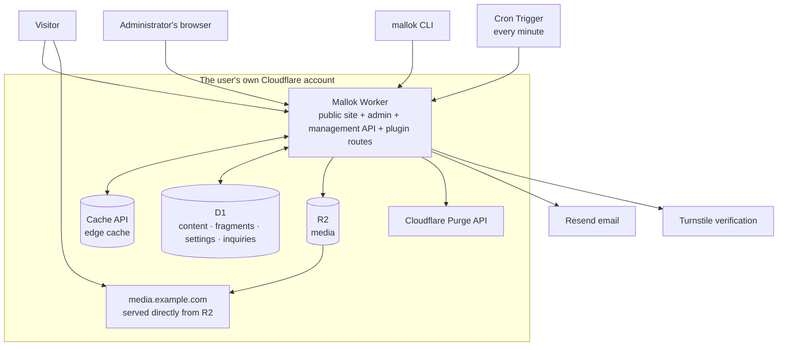

# Mallok 0.1 architecture

- Status: 0.1 architecture baseline (second revision, 2026-08-28)
- Date: 2026-08-28

This document supersedes the earlier "macOS desktop Studio, build-time
prerendering, a Worker that only looks up rows" architecture. That design
survives only in git commit `2e775cb` and earlier history, and must not be
used as the basis for a second implementation. This revision adds, on the
Cloudflare-native line: the multilingual model, content kinds, media,
inquiries and deployment entry points that the foreign-trade vertical
requires, plus the D1 fragment cache that exists for the free plan's 10 ms CPU
budget.

## 1. The architecture in one sentence

Mallok is a Worker deployed into the user's own Cloudflare account. Content
lives as Markdown in D1; media lives in R2 and is served directly through an
R2 custom domain. When content is saved, the management API renders the
Markdown into a theme-independent HTML fragment and writes it to a derived
cache in D1. When a visitor arrives, the Worker only applies the theme
template and writes the page to the edge cache, so the overwhelming majority
of visitor requests are answered by the cache. The same Worker also serves the
admin interface, the management API, the setup wizard and plugin routes; the
CLI and the local admin use that same API.

## 2. Hard constraints (the boundary conditions)

Taken from Cloudflare's official documentation (checked 2026-08-28), these are
the premise of every design decision here. **Each one must be re-verified
against a real account in the Task 01 spike. Where a measurement contradicts
this table, this document is corrected before any code is written.**

| Constraint | Free | Paid | Effect on the architecture |
| --- | --- | --- | --- |
| CPU time per request | **10 ms** | 30 s by default | Applies to **every** Worker invocation, the management API's saves included. The cache-hit path must cost almost nothing, and Markdown parsing moves off the visitor path |
| Requests | 100k/day | 10M/month | Static assets do not count; images served from an R2 custom domain do not either |
| Worker script size (gzipped) | 3 MB | 10 MB | The render pipeline, the template engine and the official plugins must all fit together. The admin app goes through Static Assets and is outside this budget |
| Worker startup time | 1 s | 1 s | No heavy initialisation at the top level; theme and template parsing must be lazy |
| Isolate memory | 128 MB | 128 MB | Never cache a whole site in memory |
| Subrequests (Cache API calls included) | 50/request | 10,000/request | The total D1, Cache and R2 calls in one render must be a small constant |
| Cron Triggers | **5 per account** | 250 per account | One cron per Worker; a free account can have scheduled work on at most five sites |
| D1 database size | 5 GB total | Billed past 5 GB | Show usage in the admin |
| D1 rows read / written | 5M/day, 100k/day; **exceeding it makes the database unavailable for the day** | 25B/month, 50M/month | Row reads per render must be bounded, and the admin must warn as the limit approaches |
| D1 queries per call | 50 | 1,000 | Queries in one render must be a constant |
| D1 row / string size | 2 MB | 2 MB | The ceiling on one Markdown document; validated on save with a clear error |
| D1 statement length | 100 KB | 100 KB | Bulk imports must be batched |
| R2 | 10 GB-month, 1M writes and 10M reads/month, free egress | $0.015/GB-month | Originals are limited by maximum edge by default; variants are few |
| Static Assets | 20k files, 25 MiB each, free requests | 100k files | How the admin app is served |
| Turnstile | 20 widgets, 10 hostnames each | — | Inquiry-form abuse protection |
| Purge API | ≤100 URLs per single-file purge; 5 tag/host/prefix/everything purges per minute | Higher | Purges must be coalesced and debounced |

Known traps, already checked:

- **The Cache API works on custom domains** (the official wording: Workers
  deployed to custom domains have access to functional cache operations). It
  does not work in the dashboard editor or the Playground preview, and **a
  Worker sitting behind Cloudflare Access cannot use the Cache API.** The
  behaviour on `.workers.dev` is not stated in the current documentation and
  must be measured. The consequence is that a custom domain is a hard
  precondition for the caching strategy, `.workers.dev` is preview only, and
  Access may protect `/_mallok/*` only if it is measured not to affect caching
  on public paths.
- **`cache.delete()` removes only the copy in the current data centre** and
  cannot be used as a global invalidation.
- **An entry stored under a Worker's custom cache key cannot be purged by
  URL** — only by tag, host, prefix or everything. This directly decides the
  choice in §6.
- **Email Workers' send binding is Paid-only** and can only send to verified
  addresses, so it cannot carry inquiry email.

## 3. The parts



One Worker, routed by prefix:

| Route | Responsibility | Cache |
| --- | --- | --- |
| `/*`, `/<locale>/*` | Rendering the public site | Edge cache |
| `/sitemap.xml`, `/feed.xml`, `/robots.txt` | The SEO endpoints built into the core | Edge cache |
| `/_mallok/setup` | The setup wizard (closes itself once complete) | `no-store` |
| `/_mallok/api/*` | The management API (authenticated) | `no-store` |
| `/_mallok/preview/<token>` | Signed draft preview | `no-store` |
| `/_mallok/p/<plugin>/*` | Routes a plugin registers, such as inquiry submission | Declared by the plugin; `no-store` by default |
| `/_mallok/*` | The admin single-page app (Static Assets) | The assets' own caching |
| `/theme/<id>/<version>/*` | Theme assets (Static Assets, produced by the build) | Long-lived, `immutable` |
| `/media/*` | An R2 media proxy, **only when no R2 custom domain is configured** | Long-lived |

The admin can be reached at that path in production or run locally through
`wrangler dev` — **the same code and the same API, with no difference in
capability.**

Source layout:

```text
src/
├── core/           # Cloudflare-independent logic: the render pipeline, the content model, validation, bundle parsing
├── worker/         # The Worker entry point, routing, caching, authentication, the wizard, cron
├── db/             # D1 schema, migrations, queries
├── admin/          # The admin single-page app
├── themes/         # The official themes (atelier, journal, gazette, manual, folio)
├── starters/       # The official starter (trade-b2b, on the atelier theme)
├── plugins/        # The plugin runtime and the official plugin (inquiry)
└── cli/            # The CLI, published separately to npm
```

`core/` must not import any Cloudflare type or global — it has to run
identically in Node (the CLI, the tests), in a browser (the admin's preview)
and in the Worker. That is the only mechanism guaranteeing the CLI and the
Worker behave the same.

## 4. The public request path

```
GET /de/products/titanium-bar
 │
 ├─ 0. Plugin onRequest hooks (redirects, access control; none by default)
 │
 ├─ 1. cache.match(request)  ── hit ──> return directly (target: under 1 ms CPU)
 │
 └─ 2. On a miss:
      ├─ one D1 batch fetching { site settings, the content row (with its assets and cached fragment), bounded data for navigation and lists }
      │   (the theme templates are not among them: they ship in the artifact, see §10)
      ├─ if the cached fragment is missing or stale: generate it now (stage one, §5) and write it back to D1
      ├─ render the complete page through the theme templates (stage two, §5)
      ├─ plugin afterRender hooks
      ├─ set Cache-Control and Cache-Tag, cache.put()
      └─ return
```

**The invariant, corrected 2026-09-02 against measurement
(`docs/ACCEPTANCE.md §14.2` item 1, `AC-INV-05`): a cold render makes at most
4 D1 round trips, each with a constant number of queries and reading a
bounded number of rows, regardless of how much content the site holds.** A
plain page with no media or relations measures 2 (`batch(5)` + `batch(1)`,
`test/worker/budget.test.ts`); resolved media adds one, and related items
with covers add one more. One batch was the original target, but the first
round trip has to return the content row — its slug, kind, front matter and
assets — before related content and media can even be looked up, so a second
round trip is a data dependency, not a shortfall to fix. Data for list pages
and navigation comes from separate, bounded queries with `LIMIT` pagination; a
query per content item is never acceptable. **A list page reads front matter
and summary fields only, and never parses body Markdown.**

Theme templates are part of the build artifact and load as strings with the
Worker. Once parsed they are cached in module scope in the isolate and reused,
never re-parsed while the isolate lives. They do not vary per request, so
there is no invalidation logic — changing themes is a deployment.

## 5. The render pipeline

Rendering has two stages, divided by whether something depends on the theme:

```
Stage one: Markdown → an HTML fragment (theme-independent, cacheable in D1)
  D1.content.markdown (standard Markdown text)
    → split off the YAML front matter
    → remark parses it into mdast (with GFM)
    → plugin beforeRender hooks (may change the AST)
    → convert to hast
    → sanitise against an allow-list (content is always untrusted)
    → substitute R2 URLs for images/ and files/ relative paths through the assets map, adding srcset / width / height / loading (§8)
    → serialise to an HTML fragment plus derived metadata (heading tree, excerpt, reading time, referenced and missing relative paths)
    → write to D1 render_cache

Stage two: fragment → complete page (theme-dependent, cached at the edge)
  the fragment plus its derived metadata
    → the theme's template engine (Liquid) renders the complete page
    → plugin afterRender hooks (may change the final HTML)
```

Stage one **runs when the management API saves content** — from the admin, a
CLI publish or an import alike — and its output goes into `render_cache`. The
visitor path normally runs stage two only. The fragment cache key is
`sha256(body) + front matter + pipeline version + the assets map (including
media dimensions and variants) + the media hostname + a hash of the enabled
plugins and their settings`; any change invalidates it, and it is rebuilt on
the next request or save. Relative paths are resolved to R2 addresses in stage
one precisely so the visitor path never parses HTML again; the cost is that
changing the media hostname invalidates every fragment once, which is an
acceptable price for a rare operation. What remains of a cold render's CPU is
Liquid and string concatenation, which is what makes the free plan's 10 ms
achievable.

Four rules that do not bend:

1. **Content is never trusted**, even when an administrator wrote it.
   Sanitisation happens when the fragment is generated and **does not modify
   the Markdown source** — the Markdown in D1 must be exportable verbatim.
2. **The same Markdown, pipeline version and theme version must render
   byte-identical HTML.** Render functions may not read the clock, a random
   source or anything about the request, and a `beforeRender` hook must be a
   pure function of (AST, front matter, plugin settings). This is the premise
   of both cache correctness and reproducible tests.
3. **The whole render pipeline lives in `core/`** and depends on no Worker
   global. The CLI's local preview, the admin's live preview and the Worker's
   production rendering run the same function.
4. **HTML is not the truth.** `render_cache` is derived data; the whole table
   can be emptied at any time and the site is still correct — the next visit
   simply rebuilds it.

Stage one on save is bound by the same 10 ms on the free plan. When a document
cannot be turned into a fragment within that budget, the save still stores the
Markdown as a draft and returns a clear error — too long, split it or upgrade
the plan — and **must not fail silently**. The acceptable length ceiling goes
into §18 once measured.

## 6. Caching

Three layers, each solving one problem:

| Layer | Where | Key | What it solves |
| --- | --- | --- | --- |
| Edge cache | Cache API | The request URL | Visitor requests never reach rendering |
| Fragment cache | D1 `render_cache` | Markdown hash + pipeline version + plugin hash | A cold render never parses Markdown |
| Template cache | Isolate module scope | Theme id + version (a build-time constant) | Liquid is never parsed twice in one isolate |

There are two goals, and they pull against each other: nearly every visitor
request should hit the edge cache, and a saved edit should appear on the
public page within a minute (`AC-CONTENT-02b`, `docs/ACCEPTANCE.md §14.2`
item 6 — reworded from "within seconds" against the real ≈ 20 s purge
round trip, `§18` item 3).

### 6.1 Writing to the cache

After rendering, `cache.put()` with
`Cache-Control: public, max-age=<site.cache_ttl>` — one hour by default,
adjustable in the admin. Every response carries a `Cache-Tag` header, drawn
from a fixed set: `site`, `c:<content_id>`, `k:<kind>:<locale>` (that kind's
list pages), `home:<locale>`, `feed:<locale>` and `sitemap`. List pages and
the home page also carry the `c:<id>` tag of every item they display.

### 6.2 Invalidation: two candidates, decided by the spike

- **Plan A: purge by tag.** On save, delete or scheduled publication, the
  management API purges by tag: the item's own `c:<id>`, its list
  `k:<kind>:<locale>`, plus `home:<locale>`, `feed:<locale>`, `tag:<locale>`
  (tag archives cross kinds, so any change can affect them) and `sitemap` —
  six tags for one save. **The limit counts calls, not tags, so an extra tag
  costs nothing.** Changing theme, navigation or site settings purges `site`.
  The official documentation confirms tag purges are unaffected by custom
  cache keys, so this also stays compatible with the fallback in §6.3.
  **Purges are still coalesced and debounced** — one call per two-second
  window within a Worker, carrying several tags — to keep call volume down
  under heavy edit traffic, and a news site saving repeatedly will queue for
  tens of seconds, which the interface must show as "cache purge queued".
  The "five tag purges per minute" ceiling this used to cite as the reason
  was not confirmed against a real account: 16 direct purge calls in quick
  succession all succeeded with no throttling observed (§18 item 3,
  2026-09-03) — the debounce is worth keeping regardless of where the real
  ceiling turns out to be, but no specific number should be asserted without
  measuring it again.
- **Plan B: purge by URL.** The cache key must then be the raw request URL
  with no customisation, and the management API computes the affected URLs —
  the item, each page of its lists, the home page, the sitemap, the feed;
  usually 20 or fewer — with a limit of 100 per call. The quota is ample, but
  computing the URL set is intricate and easy to get wrong once several
  languages are involved.
- **Both plans need** an API token with zone-level `Cache Purge` permission
  and the Zone ID, configured in the wizard and stored as a Worker secret.
  That a zone must exist is another reason a custom domain is required.

**0.1 takes plan A by default with B as the alternative. Task 01 must measure
the availability, latency and rate limits of both and write the conclusion
back here. An implementer may not pick one on the spot.**

### 6.3 The fallback: a versioned cache key

If neither A nor B survives the spike, fall back to a cache key carrying a
site-wide monotonic `content_rev`, incremented on any content change so old
keys expire naturally and no purge is needed. The cost is that every request
must first learn the current `content_rev` — one extra D1 query and its
latency. KV is not introduced; 1,000 writes a day on the free tier is not
enough.

### 6.4 What is never cached

Everything under `/_mallok/*`, which must carry
`Cache-Control: private, no-store`. Drafts and scheduled content whose time
has not come are never written to the cache. Plugin routes are uncached by
default.

### 6.5 Scheduled work

One Cron Trigger per Worker (`* * * * *`), running in order within each
invocation: due scheduled publications (change status, purge), retries of
failed email, garbage collection of the fragment cache and media references,
and the `scheduled` hooks plugins declare. A free account allows five crons,
so a portfolio beyond five sites needs Paid — which the wizard and the
documentation must say.

## 7. The content model

An outline; the exact DDL is in [DATA_MODEL.md](DATA_MODEL.md).

| Table | Purpose | Key point |
| --- | --- | --- |
| `site` | Settings, locales, navigation, SEO defaults, theme option values, enabled content kinds | A single row. **It does not record which theme is in use — the build decides that** |
| `content` | Items of every content kind | **Stores the Markdown source, the front matter and the assets map; never HTML** |
| `render_cache` | Stage one's derived fragments and metadata | Can be emptied wholesale |
| `media` | Media metadata | The bytes are in R2; this holds the sha, original filename, dimensions, type, variants and reference count |
| `redirect` | Redirects for changed URLs | Keeps inbound links alive across a slug change |
| `plugin_state` | Plugin enablement, settings, encrypted third-party keys | The official plugin's switch is immediate |
| `admin_user`, `session`, `api_token` | Administrators, admin sessions and CLI tokens | See §14 |
| `migration` | Schema version | See §15 |
| `job` | Scheduled publication, email retries and other pending work | Consumed by cron |

`content`'s core fields: `id` (a UUID that never changes), `kind` (declared by
the theme, see §10), `locale`, `translation_group` (shared by every language
of one item), `slug`, `path` (the public path as rendered), `title`,
`frontmatter` (JSON with import aliases normalised), `markdown` (the complete
`index.md` source including the front-matter block), `assets` (JSON mapping
relative paths to media shas), `status` (`draft`, `scheduled` or `published`),
`published_at`, `updated_at` and `rev`.

**`id` is the content's identity; `path` is only its current public address.**
Changing theme, slug or directory structure never changes an `id`, and a
changed `path` writes a `redirect` automatically.

Content kinds are not an enumeration in the core. The core knows two built-in
kinds, `page` and `article`; the rest — `product`, `category`, `case`, `faq`
and so on — are declared by a theme's `theme.json`, along with each kind's
front-matter schema, field types (text, number, image, image list, key-value
table, related content) and layout. `site.kinds` records what this site has
enabled. Switching to a theme that does not know a kind renders that kind's
content through the `page` layout with a warning in the admin, and **neither
the content nor its URLs are lost**.

A single `markdown` value is bound by D1's 2 MB row limit, validated on save
with a clear error and never silently truncated.

## 8. Media and R2

- The bytes live in R2 under content-addressed keys: originals at
  `media/<sha256>.<ext>`, variants at `media/<sha256>_<width>.webp` (480, 960,
  1440 and 1920 by default; a theme may narrow the set in `theme.json`).
  Identical files are stored once.
- **Markdown holds relative paths** (`images/hero.jpg`), not R2 addresses.
  `content.assets` records the sha behind each relative path for that item, so
  two articles can each have their own `images/cover.jpg` without interfering.
  Stage one substitutes the R2 URL and generates `srcset`, `sizes`, `width`,
  `height`, `loading="lazy"` and `decoding="async"`, taking the dimensions
  from the `media` table so the layout does not shift. Front-matter fields
  typed as images resolve by the same rule.
- **Image processing happens on the upload side, never in the Worker.** The
  admin converts to WebP and generates variants with the browser's Canvas; the
  CLI uses `sharp` locally, being a Node process and so exempt from the
  no-native-libraries rule. The two produce **the same specification but not
  byte-identical output**; deduplication keys on the original's sha, so
  correctness is unaffected.
- Originals are kept by default, but the wizard offers a "limit originals to
  2560 px on the longest edge" default to suit R2's free allowance. Turning it
  off keeps true originals.
- **Media is served directly from an R2 custom domain** — `media.<site
  domain>` by default, created automatically by the wizard through the DNS
  API. Image requests never touch the Worker, count against neither the
  request nor the subrequest budget, and get Cloudflare's cache.
  Content-addressing means those URLs can be cached forever
  (`max-age=31536000, immutable`): a new image is a new sha and a new URL, so
  image caches never need purging. During `.workers.dev` preview, and whenever
  no custom domain is configured, this falls back to the `/media/*` proxy.
- `media.ref_count` records how many items' `assets` reference it. Media that
  reaches zero is collected by cron after a delay — seven days by default —
  and the admin shows "unused media".
- Non-image attachments such as product datasheets live in a bundle's
  `files/`, use the same sha addressing and `assets` map, are stored as they
  are, validated against the sniffed type, and served with
  `Content-Disposition: attachment`.
- External images in the body (`https://…`) are emitted as they are after
  sanitisation — not proxied, not downloaded.
- Referencing a relative path absent from `assets` is a **normal state, not an
  error**: the content can be saved as a draft, the admin and CLI report "N
  images missing", and publishing warns without blocking. An
  `image-slots.json` produced by an AI content pipeline can be read by the CLI
  to report which slots are still empty.

The bundle format, the relative-path rules and the import/export contract are
in [CONTENT_FORMAT.md](CONTENT_FORMAT.md).

## 9. Multiple languages

- `site.locales` declares the enabled languages and `site.default_locale`. The
  default language's URLs carry no prefix; every other language is prefixed
  `/<locale>/` (`/products/x`, `/de/products/x`). In 0.1 the languages share a
  kind's base path, while slugs are set per translation.
- Every item has a `locale`, and the languages of one item share a
  `translation_group`. A translation is an independent content row — its own
  Markdown, assets, status and URL — not a field-level translation.
- The render context gives the theme every available translation of the
  current item so it can build a language switcher, and the core emits
  `hreflang` (including an `x-default` pointing at the default language) in
  `<head>` and in the sitemap automatically.
- A theme's interface strings come from the language packs its `theme.json`
  declares (`locales/<locale>.json`), selected by the site's language and the
  content's `locale`, falling back to the theme's default language.
- List pages, home pages and feeds are rendered and cached per language, under
  the `k:<kind>:<locale>` and `home:<locale>` tags.
- Not done: field-level live translation, and automatic language detection
  with redirection, which is harmful to SEO. AI translation arrives in 0.2 as
  an `onContentSave` plugin.

## 10. Themes

A theme is a **declarative** set of templates, **bundled into the artifact at
build time**, containing **no arbitrary JavaScript**.

```text
src/themes/atelier/
├── theme.json          # name, version, supported kinds and their field schemas, exposed options, image widths, language packs
├── layouts/
│   ├── base.liquid
│   ├── home.liquid
│   ├── page.liquid     # required: unsupported kinds fall back to it
│   ├── article.liquid
│   ├── product.liquid
│   ├── category.liquid
│   └── list.liquid
├── partials/
├── locales/
│   ├── en.json
│   └── zh.json
└── assets/
    └── style.css
```

- Templates and language packs are bundled into the Worker as text modules at
  build time; `assets/` is copied into the Static Assets directory and served
  at `/theme/<id>/<version>/<path>`. **Neither enters D1.**
- **Which theme is active is decided by the build** — the export from
  `src/themes/index.ts` plus a wrangler variable — not by a database field.
  Switching themes means editing source and redeploying.
- The values of a theme's **exposed options** (`theme.json`'s `options`) still
  live in `site.theme_options` and are **editable in the admin at any time,
  taking effect immediately**. The theme decides which knobs exist; the
  operator decides where they are set.
- The template engine runs in the Worker over an in-memory template map with
  no filesystem: `include`, `render` and `layout` can only reference the
  theme's own files. Every `{{ }}` output is HTML-escaped by default, and the
  `raw` filter passes through only HTML the core has marked safe — the
  sanitised body fragment and the head tags the core generates — while still
  escaping ordinary strings. Forbidden: evaluating arbitrary expressions,
  network access, prototype-chain access, unknown filters.
- What a theme can see is defined by an explicit context contract — site
  settings, the current item and its translations, bounded content lists,
  navigation, pagination, theme options, language packs, and fragments a
  plugin supplies such as the inquiry form. It is not "the whole database".
- A theme's options and content kinds are declared in `theme.json`, and the
  admin generates its forms from that. A theme author writes no admin code.
- A theme declares that it emits 0 bytes of client-side JavaScript; anything
  else must be listed in `theme.json` with its purpose. **This is checked at
  build time**: an undeclared `<script>` or `on*=` attribute in a template
  fails the build.

**Switching themes changes no content `id`, no `translation_group`, no
existing URL and nothing in the `redirect` table.** Switching to a theme that
does not know a content kind renders that kind through the `page` layout with
`site.kinds`'s base unchanged, so URLs stay — which is why every theme must
have a `page` layout.

Security position: a theme is **semi-trusted**. It cannot execute code, but it
does emit HTML and it does enter your build artifact — reviewing a theme is
the same act as reviewing any other code that enters the repository. The
template engine's escaping and the build-time checks are therefore part of the
security boundary, not formatting details.

## 11. Starters

A starter **is the repository you forked**: the theme already chosen, the
plugins already present, `wrangler.jsonc` already configured, plus a set of
example content bundles and a settings preset.

Creating a site means deploying that repository once and letting the setup
wizard import the example content and settings into D1. The official
`trade-b2b` starter provides a complete page set for a trade company: home,
product families and detail pages, about/factory/certifications, news, case
studies, an FAQ, and contact with an inquiry form.

After the import, the example content is ordinary content, indistinguishable
from anything typed by hand. Importing again overwrites, and requires explicit
confirmation.

## 12. Plugins

A plugin is real JavaScript or TypeScript, and **official and third-party
plugins take the same path**: source into `src/plugins/`, bundled into the
Worker at build time.

| Action | How it takes effect |
| --- | --- |
| Install, update or remove a plugin | Edit source, redeploy |
| Enable or disable an installed plugin (`plugin_state.enabled`) | A switch in the admin, immediate |
| Change a plugin's settings and secrets | A form in the admin, immediate |

The switch decides only whether the code runs; it does not change what code is
in the artifact. That is why it can be immediate, and it is what separates it
from installing. The interface must state both facts separately.

```text
src/plugins/inquiry/
├── plugin.json     # name, version, hooks, routes, settings and secrets, table migrations, admin panels, declared client JS
├── migrations/
│   └── 0001_inquiry.sql
└── index.ts
```

The hooks 0.1 exposes:

| Hook | When | Typical use |
| --- | --- | --- |
| `onRequest` | A request arrives, before the cache lookup | Redirects, access control |
| `beforeRender` | Stage one, once the AST exists | Custom syntax, shortcodes; must be pure |
| `afterRender` | After the complete HTML is generated | Injecting meta, structured data, form markup |
| `onContentSave` | When content is saved | Validation, auto-summaries, auto-translation, notifying something external |
| `scheduled` | Inside the once-a-minute cron | Retries, syncing, cleanup |

The six capabilities 0.1 exposes, declared in `plugin.json` and implemented by
the core:

1. **Tables**: a plugin brings SQL migrations, with table names prefixed
   `p_<plugin>_`, run and recorded by the core's migrator.
2. **Routes**: `/_mallok/p/<plugin>/<path>`, declaring method, cacheability,
   whether Turnstile verification is required, and the rate-limit key. The
   core provides body parsing, zod validation, server-side Turnstile
   verification and rate limiting through the Workers binding — which counts
   per data centre and is eventually consistent, so it deters abuse and must
   not back billing.
3. **Settings and secrets**: ordinary settings in cleartext in
   `plugin_state.settings`; anything declared a `secret` is AES-GCM encrypted
   with the deployment's `MALLOK_SECRET` into `plugin_state.secrets`, editable
   and rotatable in the admin, and never echoed in a response.
4. **Scheduled work**: the `scheduled` hook, sharing the site's single cron.
5. **Declarative admin panels**: a plugin ships no frontend code. It declares
   a settings form, generated from its schema, and a data view — table,
   columns, filters and actions such as marking, deleting or exporting CSV —
   which the admin app renders. The inquiry list, and any future order list,
   is a panel of this kind.
6. **Sending email**: the core provides
   `sendEmail({ to, subject, html, text, replyTo })`, whose only 0.1
   implementation is Resend, called through its HTTP API with `fetch` and no
   SDK. Delivery records and retries live in the core's `job` table.

Constraints:

- A plugin's CPU cost in `onRequest` or `afterRender` counts directly against
  the visitor request. A plugin must declare whether it affects the fragment
  cache key and whether it injects client-side JavaScript, and the admin must
  display both honestly.
- A plugin runs in the user's own account with the Worker's full capabilities.
  **A plugin is trusted code**, on the same security model as a WordPress
  plugin: the user is responsible for what they install. The documentation
  must say so and must not imply a sandbox.
- Every added plugin must come with bundle-size evidence; the total must stay
  within 3 MB on the free plan.

## 13. The inquiry path (the reference design for the official plugin)

```
A native HTML <form> on a product or contact page (hidden fields: content_id, locale; a honeypot field; the Turnstile widget)
  → POST /_mallok/p/inquiry/submit
  → zod validation → honeypot and submission-timing checks → server-side Turnstile verification → rate limit
  → write D1 p_inquiry_inquiry (source page, product, name, email, company, phone/WhatsApp, message, request.cf.country, user agent, time)
  → write two jobs: notify the owner (Reply-To set to the buyer's address) and auto-acknowledge the buyer (template chosen by locale)
  → attempt delivery immediately; the cron retries failures, and the status is visible
  → 302 to that language's thank-you page, which is cacheable
```

The admin panel: an inquiry list (new / replied / spam), a detail view, mark
as spam, export CSV. The settings: recipient address, sending domain and
address, the auto-acknowledgement switch and its template, and spam rules by
country and keyword. Once a Resend key is supplied, the wizard can write the
SPF and DKIM records directly through the Cloudflare DNS API, the domain being
in the same account already. Inquiry data is part of the site export, as
`inquiries.csv`.

## 14. Authentication and the security boundary

| Subject | Trust level | Boundary |
| --- | --- | --- |
| Visitor-facing content (Markdown bodies) | Untrusted | Allow-list sanitisation when the fragment is generated |
| Visitor submissions (the inquiry form) | Untrusted | zod validation, Turnstile, rate limiting, parameterised SQL, escaped email templates |
| Themes | Semi-trusted | A restricted template engine with no code execution |
| Plugins | Trusted | Installed and enabled deliberately by the user; no sandbox, and this must be stated |
| Management API callers | Authenticated | See below |

There are three Worker secrets, all set at deployment: `MALLOK_SECRET` (32
random bytes; signs sessions, encrypts third-party keys, signs preview links),
`CF_API_TOKEN` (zone-level Cache Purge and DNS Edit, used only for purging and
for the wizard's DNS writes) and `CF_ZONE_ID`. **Cloudflare's own credentials
exist only as Worker secrets**; third-party service keys such as Resend's are
encrypted into D1 so the admin can configure them, and reach neither a log nor
a response body.

Admin authentication in 0.1:

- The setup wizard sets the administrator's email and password, and
  `/_mallok/setup` closes permanently once it completes.
- Passwords are derived with WebCrypto's native PBKDF2 — a WASM Argon2 or
  bcrypt cannot run inside 10 ms of CPU — with parameters chosen from the
  spike's measured budget.
- Logging in issues a session token stored in D1, with the cookie set
  `HttpOnly; Secure; SameSite=Strict`.
- Every write requires a CSRF token.
- The management API also accepts a Bearer token for the CLI; tokens are
  generated in the admin, are revocable, and are scoped.
- Optionally, Cloudflare Access can protect `/_mallok/*`. The documentation
  gives the configuration, but only after measuring that it does not affect
  the Cache API on public paths.

Also:

- Uploads are validated against the sniffed type rather than the extension,
  and only allow-listed types are accepted.
- Error responses leak no SQL, bucket name, database id or stack trace.
- Draft preview links are signed with `MALLOK_SECRET`, expire, and are served
  `no-store` and `noindex`.

## 15. Deployment, the wizard, migration and upgrades

Three deployment entry points (see PRODUCT_VISION §5.4) converge on one setup
wizard. Each site's resources, naming and creation order are in
[CLOUDFLARE_RESOURCES.md](CLOUDFLARE_RESOURCES.md):

1. **`npx mallok create`**: drives wrangler through OAuth login, creates D1 and
   R2, generates `MALLOK_SECRET`, deploys the Worker, prints the
   `.workers.dev` address and opens the wizard. It accepts `--starter`,
   `--domain` and `--locale` so a portfolio can be scripted.
2. **The Deploy to Cloudflare button**: the official documentation confirms it
   supports GitHub and GitLab only, requires the source repository to be
   public, and creates D1, R2 and the rest from the wrangler configuration
   while wiring up Workers Builds. The Mallok repository must therefore carry
   a wrangler configuration with default resource names, and must not use a
   monorepo layout. On this path, upgrading Mallok means syncing the fork, and
   installing a third-party plugin means editing a configuration file and
   letting the build run.
3. **A hosted setup assistant** (1.0): the project site creates the resources
   on the user's behalf. Not part of 0.1.

**Schema migration runs inside the Worker**: every cold start checks the
`migration` table and, if behind, applies migrations in order within one D1
batch, with a lock row in that same table preventing concurrent duplicate
execution. Plugin migrations run with them. This keeps all three entry points
free of any CI step, so upgrading is just deploying a new Worker version.
Migrations must be forward-compatible: the old Worker version is still serving
during one, and a failure must not take the site down.

The wizard's steps at `/_mallok/setup`, **four in 0.1**
(`docs/ACCEPTANCE.md §14.2` item 2, settled 2026-09-02): administrator
account → site name and languages → choose a starter → domain (detecting
whether a custom domain is bound, and otherwise giving the steps and warning
that caching is not yet in effect), then done. Starter and domain can be
skipped. Media domain (creating `media.<domain>` automatically) and email
(the Resend key, the sending domain, writing the DNS records) are not wizard
steps: both need an account-scoped Cloudflare API token, a different
credential from the `wrangler` OAuth session the wizard runs under, so they
are configured afterward in Settings instead.

**Which actions need a redeploy must be stated plainly in one place:**

| No deployment needed (immediate from the admin) | Needs a redeploy |
| --- | --- |
| Content, media, translations | Changing theme, editing theme templates |
| Site settings, navigation, SEO defaults | Installing, updating or removing a plugin |
| The options a theme exposes | Upgrading Mallok itself |
| A plugin's enabled switch, settings and secrets | Changing wrangler configuration or adding a binding |

Before an upgrade, prompt the user to export a backup and show how to back up
D1.

## 16. Import and export

This is the executable half of the no-lock-in promise, not an added feature.
The format contract is in [CONTENT_FORMAT.md](CONTENT_FORMAT.md).

- **Export**: one operation producing bundle directories organised by content
  kind — one folder per translation group holding `index.md`,
  `index.<locale>.md`, `images/`, `files/` and `mallok.json`. Each `index*.md`
  is the D1 source emitted byte for byte, and images and attachments are
  fetched from R2 as originals under their `assets` filenames. Alongside them:
  `site.json` (settings and navigation), `redirects.csv`, `inquiries.csv` when
  the inquiry plugin is enabled, and `media/` for anything unreferenced. Front
  matter carries only generic fields; `mallok.json` is the one private file
  and holds only `id` and `translation_group`, which other tools ignore.
- **Import**: accepts bundle directories, and in 0.1 covers at least generic
  Markdown and the common front-matter shapes of Astro Content Collections.
  Relative-path images are uploaded per §8 and recorded in `assets`.
- **Round-trip fidelity must be tested**: export, import, export again, and
  every `index.md` and image is byte-identical while `id`, `locale` and
  `translation_group` are unchanged. This is a mandatory regression test, not
  a best effort.
- A WordPress importer and product CSV/Excel import belong to 0.2.

## 17. Deliberately not done

- No image processing in the Worker.
- No loading remote code or dynamic `import` at runtime.
- No ORM, no general plugin-marketplace runtime, no second template engine, no
  second render pipeline.
- **No runtime installation**: neither themes nor plugins are installed by
  uploading a package, so the Worker contains no unpacking, no package
  validation and no install transaction. All of that happens at build time.
- No Workers KV and no Queues — 0.1 does not need them, and the free
  allowances do not suit.
- No Mallok-side accounts, billing or multi-tenant control plane.
- No collaborative editing and no revision-history UI; 0.1 keeps the `rev`
  column but builds no interface for it.
- No field-level translation and no automatic language redirection.
- No provider or adapter layer abstracted for a need that has not arrived —
  0.1 targets Cloudflare only, and email has one implementation in Resend
  (`sendEmail` is an internal function boundary, not a provider layer).

## 18. Open items

**Measured 2026-09-03 against a real Cloudflare account** (`tasks/TASK-01.md
§4`, §5 for the full table and raw numbers). Items 7 and 9 still need a
public repository and Turnstile/Resend accounts respectively and remain
unmeasured; everything else below is real-account fact, not a projection.

1. **The Cache API works on `.workers.dev`, with no custom domain
   precondition**, and identically on a bound custom domain (`MISS` then
   `HIT` in both cases). **Not tested**: whether it still works on public
   paths when Cloudflare Access protects `/_mallok/*` — needs a Zero Trust
   application, out of scope for this run.
2. **The current pipeline does not fit the CPU budget, at any size tested.**
   Stage-one fragment generation on real workerd: 60 ms (2 KB), 150 ms
   (8 KB), 528 ms (32 KB), 726 ms (128 KB) — 6× to 73× the Free plan's 10 ms,
   even for a short article. This is worse than the local warm-JIT estimate
   in `TASK-01.md §3.2` suggested, and confirms that estimate's own
   cold-process figure (≈ 60 ms at 2 KB) rather than its warm one. **The
   `markdown-it` fallback `TECH_STACK.md §4` names is no longer a
   recommendation to consider — it is what the numbers say is needed**,
   unless the product owner accepts that saving content routinely exceeds
   the Free plan's CPU budget. Stage-two cold render measured 75 ms CPU;
   no error 1102 (CPU-limit kill) was observed in any test this run.
3. **Tag purging affects entries the Cache API wrote, and works.** A direct
   purge call returns `200`/`ok:true`. Real propagation delay from a save to
   the edit being visible: **≈ 20 seconds** — real and far better than an
   unpurged page's TTL, but worth checking against `AC-CONTENT-02b`'s
   "seconds" wording. Rate-limiting: 16 purge calls (6 spaced 2 s apart, then
   10 back-to-back) all succeeded with no throttling observed — this
   contradicts the "five per minute" figure `cache.ts` asserted in a comment,
   which has been corrected to state only what was actually observed. Plan A
   is confirmed workable; plan B (URL purging) was not separately tested
   since plan A works.
4. **285.5 KiB gzip** (232.3 KiB before `rehype-raw`, added 2026-09-02 —
   `docs/ACCEPTANCE.md AC-INV-04`), 9.3% of the Free plan's 3 MB.
5. **50,000 iterations costs ≈ 10 ms CPU** on real workerd — at the edge of
   the 10 ms budget, not comfortably under it. **100,000 costs ≈ 35 ms**, and
   iteration counts above 100,000 are **rejected outright by workerd's
   WebCrypto implementation** ("iteration counts above 100000 are not
   supported") — a hard platform ceiling, not a CPU-budget question.
   `PBKDF2_RECOMMENDED_ITERATIONS = 600_000` (OWASP's figure, shown to users
   as a disclosure) is **unreachable on this runtime**; `credentials.ts`'s
   comment now says so. Whether to change the constant, and what to disclose
   instead, is for the product owner.
6. **R2 custom domains work and serve byte-identical content, but are not
   cached by Cloudflare's edge by default** — `cf-cache-status: DYNAMIC` on
   both a first and a second fetch of the same object. Serving media
   efficiently through `media.<domain>` needs an explicit Cache Rule this run
   did not configure. Token permissions for the wizard to create the DNS
   record were not separately isolated — the account-scoped token used here
   also covered the R2 custom-domain connect step, which was done by hand in
   the dashboard rather than via API.
7. **Not tested.** Needs a public repository; `FobStack/mallok` is currently
   private.
8. **Confirmed correct under real concurrent cold starts, on two independent
   fresh databases**: ten parallel first requests each time, exactly one
   `migration` row per migration (core plus the `inquiry` plugin) with no
   duplicates, and the lock released (`locked_by`/`locked_at` both `NULL`)
   both times. One run additionally returned a single `404` among ten `200`s
   that did not reproduce on the second run; recorded as an unexplained,
   likely transient anomaly rather than a confirmed defect.
9. **Not tested.** Needs a Turnstile site key and a Resend account with a
   verified sending domain.

**Also found while setting up this spike, not one of the nine**: copying
`wrangler.jsonc` into `.mallok/sites/<slug>.jsonc` and deploying with `-c`
fails, because `main` and `assets.directory` are relative paths that wrangler
resolves against the config file's own location, not the working directory —
and `buildSiteConfig` (`src/cli/provision.ts`) never adjusted them. This is a
confirmed bug: `mallok create` would fail at the deploy step on a real
account. Fixed 2026-09-03 (`src/cli/provision.ts`).
