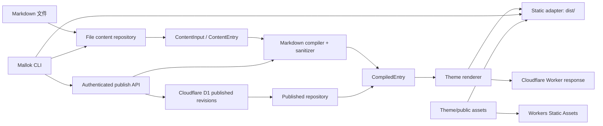

# Mallok 技术架构

- 状态：MVP 基线草案
- 版本：0.1.0
- 日期：2026-08-26

## 1. 架构结论

Mallok 使用一个平台无关的渲染内核和两个部署适配器：

- 静态适配器在 Node.js 构建阶段写出完整站点；
- Cloudflare 适配器在 Worker 中从 D1 读取已发布的编译结果并套用主题，同时由 Workers Static Assets 承载 CSS、图片等资源。

截至 2026-08，Cloudflare 官方已将 Workers Static Assets 作为新静态和全栈项目的推荐路径。因此 Mallok 不以 Pages 作为默认部署模型，也不使用已废弃的 Workers Sites。

## 2. 总体结构



## 3. 代码仓库

```text
mallok/
├── packages/
│   ├── core/              # 平台无关模型、Markdown、路由、渲染与构建计划
│   ├── cli/               # mallok 命令
│   ├── cloudflare/        # Worker、D1 repository、管理 API、部署适配
│   └── create-mallok/     # 可选的 npm create 入口；MVP 后段完成
├── examples/
│   └── basic-blog/        # 端到端契约样例
├── docs/
├── .claude/prompts/
├── pnpm-workspace.yaml
└── package.json
```

MVP 不提前拆分 `markdown`、`theme`、`shared` 等细粒度包。只有形成稳定独立 API 后才拆包，避免在产品尚未验证时制造版本协调成本。

## 4. 依赖边界

### 4.1 `@mallok/core`

允许依赖 Web 标准 API 和纯 JavaScript 库，不得依赖：

- `node:*`；
- Cloudflare 类型或绑定；
- 文件系统；
- HTTP server；
- Wrangler；
- UI 框架。

核心明确区分作者源与发布投影。Markdown compiler 只位于作者源到编译结果的边界，不位于公开请求路径：

```ts
export interface SourceRepository {
  list(): Promise<readonly ContentEntry[]>;
  findById(id: string): Promise<ContentEntry | null>;
}

export interface PublishedRepository {
  listPublished(query: PublishedQuery, asOf: string): Promise<readonly CompiledEntry[]>;
  findPublishedBySlug(slug: string, asOf: string): Promise<CompiledEntry | null>;
}

export interface PublishedQuery {
  readonly limit?: number;  // default 20, range 1..100
  readonly offset?: number; // default 0, non-negative integer
  readonly tag?: string;
}

export interface BuildWriter {
  write(path: string, body: Uint8Array | string): Promise<void>;
}

export interface Clock { now(): Date; }
```

### 4.2 `@mallok/cli`

拥有 Node 文件系统、开发服务器、配置加载、进程调用和交互提示。CLI 调用 core，不复制内容规则。

### 4.3 `@mallok/cloudflare`

拥有 D1 binding、Worker `fetch`、管理 API 和 Cloudflare 输出配置。它实现 core 的端口，不向 core 反向泄露平台类型。

## 5. 统一内容模型

```ts
export type JsonPrimitive = null | boolean | number | string;
export type JsonValue = JsonPrimitive | readonly JsonValue[] | { readonly [key: string]: JsonValue };

export interface ContentInput {
  readonly id: string;
  readonly slug: string;
  readonly title: string;
  readonly description?: string;
  readonly bodyMarkdown: string;
  readonly draft?: boolean;
  readonly publishedAt?: string;
  readonly updatedAt?: string;
  readonly tags?: readonly string[];
  readonly template?: string;
  readonly data?: Readonly<Record<string, JsonValue>>;
}

export interface ContentEntry {
  readonly id: string;
  readonly type: "article";
  readonly slug: string;
  readonly title: string;
  readonly description?: string;
  readonly bodyMarkdown: string;
  readonly status: "draft" | "published";
  readonly publishedAt?: string;
  readonly updatedAt?: string;
  readonly tags: readonly string[];
  readonly template: string;
  readonly data: Readonly<Record<string, JsonValue>>;
}

export interface CompiledEntry extends Omit<ContentEntry, "bodyMarkdown"> {
  readonly sourceMarkdown: string;
  readonly bodyHtml: SafeHtml;
  readonly sourceHash: string;
  readonly artifactHash: string;
  readonly compilerVersion: string;
}
```

约束：

- `id` 是 frontmatter 中必填的 RFC 9562 canonical UUID（非 nil，variant 1，version 1–8），规范化为小写；由 `mallok new` 或 starter 生成，移动文件和修改 slug 都不改变它；
- `draft` 缺失时规范化为 `false`，`tags` 为 `[]`，`template` 为 `article`，`data` 为 `{}`；
- `updatedAt` 不从文件 mtime 推导；缺失时保持缺失；
- 日期输入必须是带时区的 ISO 8601 字符串，进入模型后统一为 UTC `toISOString()`；
- `slug` 是 1–100 字符的小写 ASCII kebab-case 单段，不接受斜杠、百分号、点段、空段或 Windows 保留设备名（`con/prn/aux/nul/com1..9/lpt1..9`）；完整 URL 与输出路径只由 route planner 生成；
- `title` trim 后 1–200 个 Unicode code point；`description` trim 后最多 500 个 code point；正文统一 LF、不能只含空白、UTF-8 最大 1 MiB；
- tags 最多 20 个，每项 NFC + trim 后 1–50 字符，按首次出现保序并做完全相同值去重；`template` 匹配 `[a-z][a-z0-9-]{0,63}`；
- `data` 只允许上述 `JsonValue`，最大深度 8、对象键总数 100、规范 JSON 的 UTF-8 最大 32 KiB；
- D1 repository 返回 `CompiledEntry`，不得把数据库字符串未经受控恢复直接伪装成 `SafeHtml`；
- 排序必须有稳定的第二关键字，例如 `publishedAt desc, slug asc`。

在发布边界上，`ContentEntry` 会被 compiler 转换为 `CompiledEntry`。哈希算法固定为 SHA-256 小写 hex：`sourceHash` 是规范 JSON（所有对象键递归排序、数组保序、LF、UTF-8）的哈希；`artifactHash` 是 `{ sourceHash, compilerVersion, schemaVersion, compileOptions }` 规范 JSON 的哈希。MVP 固定 `COMPILER_VERSION = "1"`、`SCHEMA_VERSION = "1"`，默认 compile options 为 `{ gfm: true, allowRawHtml: false, sanitizeSchemaId: "mallok-default-v1" }`；调用者不得覆盖这三个安全选项。artifact hash 因此会在 sanitizer/compiler/schema 或影响输出的选项变化时改变。哈希通过 Web Crypto 实现，所以 compile API 是异步的。静态构建在内存中使用编译结果；D1 动态模式将其序列化为不可变 revision。受控的 D1 row mapper 必须验证 compiler/schema 标记后才能恢复 `SafeHtml`。

MVP route planner 的固定输出是 `/` → `index.html`、`/articles/<slug>/` → `articles/<slug>/index.html`、`/404.html`、`/rss.xml` 和 `/sitemap.xml`。planner 只接受已校验 slug，输出允许多段的 POSIX 相对路径，并在写文件前再次拒绝绝对路径、盘符/UNC、空段、`.`、`..`、反斜杠、NUL、百分号和 Windows 保留设备名段。Phase 1A 只实现这套纯词法契约，真实文件系统边界由 Phase 1B adapter 负责。

## 6. Markdown 管道

推荐使用成熟 parser 组合，而不是自研语法：

1. frontmatter parser 读取 YAML；
2. schema validator 规范字段；
3. CommonMark/GFM parser 生成语法树；
4. 禁用或移除原始 HTML；
5. 协议白名单和 HTML sanitize；
6. 输出带品牌类型的 `SafeHtml`。

```ts
declare const safeHtmlBrand: unique symbol;

export interface SafeHtml {
  readonly value: string;
  readonly [safeHtmlBrand]: true;
}
```

`SafeHtml` 必须是不可变的不透明对象，而不是仅存在于类型层的 `string & brand`；否则 tagged template 在运行时无法区分可信片段和普通字符串。只有 Markdown sanitizer 和模板文档构建器可以创建 `SafeHtml`。不得从包入口公开无提示的 `unsafeHtml(string)`。

## 7. Theme API

MVP 使用受信任的 ESM 主题模块，而不是自研模板语法。这样可以先稳定页面上下文与安全插值规则，再决定是否增加 Liquid 等文件模板适配器。

```ts
export interface MallokTheme {
  readonly name: string;
  readonly runtime: "universal";
  renderHome(context: HomePageContext): Promise<SafeHtml> | SafeHtml;
  renderArticle(context: ArticlePageContext): Promise<SafeHtml> | SafeHtml;
  renderNotFound(context: NotFoundPageContext): Promise<SafeHtml> | SafeHtml;
}
```

核心提供：

- `html` tagged template：文本节点接受普通值和 `SafeHtml`；tag 内只接受由 `attribute(name, value)` 或 `urlAttribute(name, safeUrl)` 生成的不透明属性片段；检测到动态 tag/属性名、未包装属性值或 `script/style` 插值时抛出 `HTML_CONTEXT_UNSAFE`；
- `SafeHtml`：只允许受控的已清洗片段不转义；
- `escapeHtmlText`、`escapeHtmlAttribute`、`attribute`、带协议白名单的 `safeUrl/urlAttribute`，以及返回完整安全 `<script>` 片段的 `jsonScript` helper；事件属性与 `style` 不允许通过属性 helper 生成；
- 标准页面上下文与分页模型。

特别规则：JSON-LD 序列化必须转义 `<`、`>`、`&` 和 Unicode 行分隔符，不能把普通 `JSON.stringify` 结果原样插入 `<script>`。不提供容易被误用的“半安全 JSON 字符串”；公开 helper 负责生成完整 script 元素。

`safeUrl` 允许 `https:`、`http:`、`mailto:`、`tel:`、根/路径相对 URL、query 和 fragment；拒绝协议相对 URL、控制字符、混淆空白以及 `javascript:`、`data:`、`vbscript:`、`file:`、`blob:` 等协议。媒体发布层可以在此基础上施加更严格的 HTTPS/已部署资源限制。

主题是项目拥有者本地安装和构建的可信代码，不是多租户沙箱。`runtime: "universal"` 主题不得导入 Node builtin、读取环境/网络/系统时间或随机数；所有时间和数据从 context 获取，并同时通过 Node 与 Worker bundle 检查。远程上传主题不在 MVP 范围内。

## 8. 配置

MVP 配置入口为 `mallok.config.mjs`，避免首版引入 TypeScript 配置转译器：

```js
export default {
  site: {
    title: "My Mallok Site",
    url: "https://example.com",
    language: "zh-CN"
  },
  content: {
    directory: "content/articles"
  },
  theme: "./theme/index.mjs",
  output: {
    directory: "dist",
    target: "static"
  }
};
```

配置文件属于受信任代码。所有路径必须相对于项目根解析，并在读写前验证边界。输出目录不得等于项目根、用户主目录或文件系统根。

## 9. 静态构建

```text
读取配置
  -> 扫描内容和公开资源
  -> 解析/校验/规范化
  -> 创建确定性 route plan
  -> 渲染到临时目录
  -> 生成 RSS/sitemap/404
  -> 完整性检查
  -> 原子替换正式输出目录
```

构建器在开始时固定 `asOf`，并把它作为显式输入传给发布过滤；相同结果只承诺在 content/config/theme/version/`asOf` 全部相同时成立。文件 mtime、随机数和构建结束时间不得进入产物。构建器不在失败后删除用户已有的输出目录。临时目录必须位于项目内 `.mallok/tmp/<build-id>`，目标经过 `realpath`、symlink/junction 和项目边界校验后再替换。

## 10. Cloudflare 运行时

### 10.1 路由

- `/assets/*`：Workers Static Assets 直接处理；
- `/__mallok/api/v1/*`：Worker 优先，永不缓存；
- `/articles/*`：Worker 查询 D1 并渲染；
- `/`：动态模式下由 Worker 渲染文章列表；
- `/rss.xml`、`/sitemap.xml`：动态模式下由 Worker 从同一 published revision 集合生成；
- 其他已生成资源：由 `ASSETS` binding 回退；
- 404：使用同一个主题契约。

Wrangler 使用 `assets.directory` 和选择性的 `run_worker_first`，不使用已废弃的 `site` 配置。动态 target 不得生成与上述动态路由同名的静态文件，否则 asset-first 可能绕过 D1。公开动态响应携带 revision id/ETag；发布成功后对 cache-busted 请求立即可见，普通 URL 的新鲜度上限为 60 秒。

MVP 不包含 R2 写入链路。发布校验只接受绝对 HTTPS 媒体 URL或已经存在于部署清单的 `/assets/` 路径；新的相对本地媒体引用必须阻止 publish，不能生成线上必然破损的文章。

### 10.2 D1 schema

首个 migration 使用 document + immutable revision + published pointer：

```sql
CREATE TABLE documents (
  id TEXT PRIMARY KEY,
  type TEXT NOT NULL DEFAULT 'article',
  slug TEXT NOT NULL UNIQUE,
  version INTEGER NOT NULL DEFAULT 0,
  created_at TEXT NOT NULL,
  updated_at TEXT NOT NULL
);

CREATE TABLE document_revisions (
  id TEXT PRIMARY KEY,
  document_id TEXT NOT NULL REFERENCES documents(id) ON DELETE CASCADE,
  revision_number INTEGER NOT NULL,
  source_markdown TEXT NOT NULL,
  frontmatter_json TEXT NOT NULL,
  body_html TEXT NOT NULL,
  source_hash TEXT NOT NULL,
  artifact_hash TEXT NOT NULL,
  compiler_version TEXT NOT NULL,
  created_at TEXT NOT NULL,
  UNIQUE(document_id, revision_number),
  UNIQUE(document_id, artifact_hash),
  UNIQUE(document_id, id)
);

CREATE TABLE published_documents (
  document_id TEXT PRIMARY KEY REFERENCES documents(id) ON DELETE CASCADE,
  revision_id TEXT NOT NULL,
  published_at TEXT NOT NULL,
  FOREIGN KEY(document_id, revision_id)
    REFERENCES document_revisions(document_id, id)
);

CREATE INDEX idx_published_documents_date
  ON published_documents(published_at DESC, document_id ASC);

CREATE TABLE idempotency_keys (
  key TEXT PRIMARY KEY,
  request_hash TEXT NOT NULL,
  response_json TEXT NOT NULL,
  created_at TEXT NOT NULL,
  expires_at TEXT NOT NULL
);
```

时间以应用生成的 UTC ISO 字符串写入。对外一次 `publishRevision` 必须在单个原子数据库操作中校验预期 `version`、创建 revision、更新 `published_documents`、增加 version 并记录 idempotency response；CAS 失败必须使整次写入回滚。D1 adapter 可以用 transaction-safe batch 配合约束/trigger 实现，但不能用“先查再写”的无保护序列。直接修改历史 revision 不属于支持的操作。

### 10.3 管理 API

最小接口：

```text
GET    /__mallok/api/v1/documents
POST   /__mallok/api/v1/documents/:id/publish
POST   /__mallok/api/v1/documents/:id/unpublish
GET    /__mallok/api/v1/health
```

约束：

- 管理接口全部需要 `Authorization: Bearer <token>`；
- token 仅通过 Worker secret `MALLOK_ADMIN_TOKEN` 提供；
- 比较摘要而非记录明文，避免明显的时序泄漏；
- body 设置硬上限，JSON schema 严格校验；
- publish 要求 `If-Match` 或等价预期版本，并支持 idempotency key；同一个 key + 同一个 request hash 返回第一次保存的响应，同 key + 不同 body 返回 409；默认保留 24 小时；
- 服务端以源 Markdown 重新运行 compiler，不接受客户端声称“已安全”的 HTML；
- D1 使用 prepared statement 参数；
- 错误返回稳定 code，不返回 SQL 和堆栈；
- 所有管理响应 `Cache-Control: no-store`；
- 未配置 token 时管理接口默认不可用，而不是无认证开放。

MVP 只有 CLI 调用这一接口。GUI 将来可以复用领域服务，但其作者源、浏览器认证和 CSRF 模型需要独立 ADR，不能直接把长期管理 token 存进浏览器 localStorage。

## 11. CLI 与部署

CLI 使用 Node 内置参数解析能力或轻量解析层，命令实现不直接调用 `process.exit`，以便测试。

`mallok provision` 的职责是生成计划并创建/复用项目专属云资源；`mallok deploy` 不隐式创建资源，其职责是：

1. doctor；
2. 校验目标和 git 忽略规则；
3. 构建；
4. 显示计划；
5. 用户显式确认后迁移已绑定 D1 并调用项目本地 Wrangler；
6. 输出部署结果。

CLI 不直接保存 Cloudflare API token，不生成包含真实 `database_id` 的公共模板，不在 CI 中依赖交互式 Wrangler 自动检测。首次引导可以编排 provision 与 deploy，但两步各自保存状态和恢复说明。

## 12. 错误模型

```ts
export class MallokError extends Error {
  constructor(
    readonly code: MallokErrorCode,
    message: string,
    readonly hint?: string,
    readonly cause?: unknown
  ) {
    super(message);
  }
}
```

初始错误码：

- `CONFIG_NOT_FOUND`
- `CONFIG_INVALID`
- `CONTENT_INVALID`
- `CONTENT_ID_INVALID`
- `CONTENT_SLUG_INVALID`
- `CONTENT_DATE_INVALID`
- `CONTENT_DATA_INVALID`
- `CONTENT_DUPLICATE_ID`
- `CONTENT_DUPLICATE_SLUG`
- `PATH_OUTSIDE_PROJECT`
- `HTML_CONTEXT_UNSAFE`
- `URL_UNSAFE`
- `THEME_INVALID`
- `BUILD_FAILED`
- `AUTH_REQUIRED`
- `AUTH_INVALID`
- `DATABASE_ERROR`
- `DEPLOY_BLOCKED`

Phase 1A 必须实现从 `CONTENT_INVALID` 到 `URL_UNSAFE` 的内容与安全错误码；其余错误码在对应 adapter 阶段实现。`hint` 仅在调用者存在可执行修复动作时必填，纯内部错误可以省略并由上层映射。

## 13. 测试架构

### 单元测试

- frontmatter 与 schema；
- slug、URL route 和相对输出路径的纯词法边界；
- 草稿/未来发布过滤；
- Markdown XSS；
- HTML 与 JSON-LD 转义；
- route plan 确定性；
- D1 row 映射和 API 输入校验。

### 集成测试

- 临时项目从 Markdown 构建完整目录；
- `realpath`、symlink/junction 越界和原子目录替换；
- 失败构建不破坏上次输出；
- 基础主题在静态/Worker 两种模式输出相同正文结构；
- 本地 D1 migration、写入、修订、公开读取；
- 管理 API 认证和缓存头。
- publish CAS、idempotency 和中途故障回滚。

### 端到端测试

- `mallok init -> build -> preview smoke request`；
- `publish -> Worker route -> updated HTML`，使用本地 Cloudflare 测试环境，不访问真实账号。

## 14. 可观测性与隐私

MVP 默认结构化日志包含 request id、route、status、duration 和稳定错误码，不记录 token、完整请求体或文章未发布内容。遥测默认关闭；未来若增加，必须 opt-in 并单独记录决策。

## 15. 官方资料基线

以下链接是 2026-08-26 制定 Cloudflare 适配方案时的事实依据；实现阶段仍需锁定并记录实际 Wrangler 版本：

- [Cloudflare Workers Static Assets](https://developers.cloudflare.com/workers/static-assets/)
- [Workers Static Assets 配置](https://developers.cloudflare.com/workers/wrangler/configuration/#assets)
- [从 Pages 迁移到 Workers](https://developers.cloudflare.com/workers/static-assets/migration-guides/migrate-from-pages/)
- [D1 migrations](https://developers.cloudflare.com/d1/reference/migrations/)
- [D1 Worker Binding API](https://developers.cloudflare.com/d1/worker-api/)
- [Wrangler deploy](https://developers.cloudflare.com/workers/wrangler/commands/workers/#deploy)
