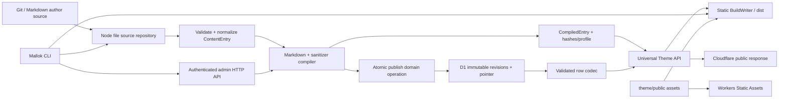

# Mallok 技术架构

- 状态：Accepted MVP architecture
- 版本：0.1
- 日期：2026-08-27

本文定义模块、数据流和跨领域不变量。字段、命令、HTTP、SQL、主题与部署细节分别以 [文档导航](README.md) 中的领域 reference 为准；本文不作为第二套 schema。

## 1. 核心结论

Mallok 自己实现内容引擎、路由/构建计划、Theme contract、CLI 和 Cloudflare adapter，不建立在 Astro/Next 等站点框架上。它仍使用成熟的 Markdown、YAML、HTML、测试和 bundling 库；“自己手搓”不等于重写 parser/sanitizer。

产品有两个诚实 target：

- `static`：Node 构建时从 Markdown 编译并写完整目录；内容变化必须重建；
- `cloudflare`：发布时服务端编译到 D1 revision，请求时读取 `CompiledEntry` 并套同一主题；内容更新不重部署 Worker。

双 target 分阶段交付：static alpha 先行，Cloudflare alpha 后行，跨模式与 staging 门通过后才是 MVP RC。对应决策见 [ADR-0001](adr/0001-dual-runtime.md)。

## 2. 系统视图



Markdown/Git 是作者真相，D1 是线上发布投影。MVP 禁止 GUI、控制台脚本或其他客户端绕过管理 API 直接写 D1。

## 3. Monorepo 与依赖方向

```text
mallok/
├── packages/
│   ├── core/               # Web 标准平台无关模型、compiler、safe HTML、theme/route/feed contract
│   ├── cli/                # Node 配置/FS/build/dev/preview/命令与远程 client
│   ├── cloudflare/         # Worker、D1、HTTP、Wrangler config/deploy adapter
│   └── create-mallok/      # 发布后段的 npm create 入口
├── examples/basic-blog/    # 唯一 golden E2E fixture
├── docs/
└── package.json
```

依赖方向：

```text
cli ----------> core <---------- cloudflare
create-mallok -> published CLI/template contract
examples -----> public package surfaces only
```

`@mallok/core` 只依赖 Web 标准与 Worker-compatible 纯 JS 库，不导入 `node:*`、filesystem、HTTP server、D1、Wrangler 或 Cloudflare types。Node/Cloudflare adapter 实现 core port，不把平台类型泄漏进 core。

MVP 不提前拆出 markdown/theme/shared 等细包，避免尚未稳定时产生版本协调成本。包与工具版本见 [VERSIONING.md](VERSIONING.md)。

## 4. 核心数据与端口

规范化类型/限制见 [CONTENT_CONFIG.md](CONTENT_CONFIG.md)。架构上区分：

- `ContentInput`：frontmatter + Markdown 的结构化未规范输入；
- `ContentEntry`：校验、默认、日期、JSON 和换行规范化后的作者对象；
- `CompiledEntry`：把规范化 Markdown 改名为受控 `sourceMarkdown`，加入 `SafeHtml`、source/artifact hash 与完整 compile profile；单一 persisted artifact/row-codec format 属于 adapter 持久化 envelope，不伪装成作者字段；
- `PublishedDocument`：document version、current revision 与 activation metadata 的查询视图。

公共核心模型固定如下；字段限制、默认值与规范化算法仍以 [CONTENT_CONFIG.md](CONTENT_CONFIG.md) 为准：

```ts
export type JsonPrimitive = null | boolean | number | string;
export type JsonValue =
  | JsonPrimitive
  | readonly JsonValue[]
  | { readonly [key: string]: JsonValue };

export interface ContentInput {
  readonly id: string;
  readonly slug: string;
  readonly title: string;
  readonly description?: string;
  readonly bodyMarkdown: string;
  readonly draft?: boolean;
  readonly publishedAt?: string;
  readonly updatedAt?: string;
  readonly tags?: readonly string[];
  readonly template?: string;
  readonly data?: Readonly<Record<string, JsonValue>>;
}

export interface ContentEntry {
  readonly id: string;
  readonly type: "article";
  readonly slug: string;
  readonly title: string;
  readonly description?: string;
  readonly bodyMarkdown: string;
  readonly status: "draft" | "published";
  readonly publishedAt?: string;
  readonly updatedAt?: string;
  readonly tags: readonly string[];
  readonly template: string;
  readonly data: Readonly<Record<string, JsonValue>>;
}

export interface CompileProfileV1 {
  readonly compilerVersion: "1";
  readonly schemaVersion: "1";
  readonly compileProfileId: "mallok-default-v1";
  readonly compileOptions: Readonly<{
    readonly allowRawHtml: false;
    readonly gfm: true;
    readonly sanitizeSchemaId: "mallok-default-v1";
  }>;
}

export type CompiledEntry =
  & Omit<ContentEntry, "bodyMarkdown">
  & CompileProfileV1
  & Readonly<{
    sourceMarkdown: string;
    bodyHtml: SafeHtml;
    sourceHash: string;
    artifactHash: string;
  }>;

export interface MediaAssetReference {
  readonly url: string; // normalized /assets/** URL
}

export type PublishedArtifact = CompiledEntry & Readonly<{
  assetReferences: readonly MediaAssetReference[];
}>;

export interface PublishedSummary {
  readonly id: string;
  readonly revisionId: string;
  readonly artifactHash: string;
  readonly slug: string;
  readonly title: string;
  readonly description?: string;
  readonly publishedAt?: string;
  readonly updatedAt?: string;
  readonly tags: readonly string[];
}
```

`draft` 只存在于未规范化输入；进入 `ContentEntry` 后转换为 `status`。`sourceMarkdown` 必须逐字节等于规范化后的 `bodyMarkdown`，不能保存另一份未经规范化的正文。optional 字段缺失时在对象上保持缺失；哈希输入按下文显式转成 `null`，消除“省略还是 null”的实现分歧。

```ts
export interface SourceRepository {
  list(): Promise<readonly ContentEntry[]>;
  findById(id: string): Promise<ContentEntry | null>;
}

export interface PublishedRepository {
  listPublishedSummaries(
    query: PublishedQuery,
    asOf: string,
  ): Promise<readonly PublishedSummary[]>;
  findPublishedBySlug(slug: string, asOf: string): Promise<PublishedArtifact | null>;
  listSitemapEntries(asOf: string): Promise<readonly SitemapEntry[]>;
}

export interface PublishedQuery {
  readonly limit?: number;   // default 20, 1..100
  readonly offset?: number;  // default 0
  readonly tag?: string;
}

export interface SitemapEntry {
  readonly id: string;
  readonly slug: string;
  readonly publishedAt?: string;
  readonly updatedAt?: string;
}

export interface BuildWriter {
  write(route: PlannedOutput, body: Uint8Array | string): Promise<void>;
}

export interface Clock { now(): Date; }
```

调用者只把 route planner 产生的 `PlannedOutput` 交给 writer，不能把 slug 或 URL string 直接当 filesystem path。当前 public route 不暴露分页/tag archive；query 的 offset/tag 为 repository 能力和未来兼容，不授权主题发明路由。首页与 RSS 只能读取 `PublishedSummary`，不得把 source/body/data/template 从 D1 拉入集合响应；sitemap 使用另一条单 statement 轻量 query，不能用多次 offset 查询拼接，避免并发 publish 时重复或漏项。Cloudflare adapter 对一次 summary query 的所选 TEXT 字段施加 2 MiB aggregate-byte 上限，超限 fail closed，防止合法单行预算组合突破 Worker 内存边界。

## 5. 编译与安全 HTML

```text
UTF-8/YAML input
  -> strict schema + canonical normalization
  -> CommonMark/GFM AST
  -> raw HTML removal
  -> fixed sanitizer/URL policy
  -> SafeHtml
  -> sourceHash + artifactHash + versioned profile
```

编译是异步且平台无关的，SHA-256 使用 Web Crypto。canonical JSON、哈希输入、field 限制见 [CONTENT_CONFIG.md](CONTENT_CONFIG.md)；安全边界见 [SECURITY.md](SECURITY.md)。

哈希不是实现者可选择的摘要。两个输入对象和编码固定为：

```ts
sourceHash = sha256Hex(utf8(canonicalJson({
  id: entry.id,
  type: "article",
  slug: entry.slug,
  title: entry.title,
  description: entry.description ?? null,
  bodyMarkdown: entry.bodyMarkdown,
  status: entry.status,
  publishedAt: entry.publishedAt ?? null,
  updatedAt: entry.updatedAt ?? null,
  tags: entry.tags,
  template: entry.template,
  data: entry.data,
})));

artifactHash = sha256Hex(utf8(canonicalJson({
  sourceHash,
  compilerVersion: "1",
  schemaVersion: "1",
  compileOptions: {
    allowRawHtml: false,
    gfm: true,
    sanitizeSchemaId: "mallok-default-v1",
  },
})));
```

`sha256Hex` 输出 64 位小写 hex；`utf8` 是无 BOM 的 UTF-8。`compileProfileId` 是上述固定 options 的可读别名，不作为独立行为输入；实现必须验证别名和 options 对应，不能允许二者漂移。持久化只有一个 `artifact_format_version` 版本轴，它同时标识 artifact envelope 与 row codec 格式；该版本不进入这两个 hash，但 decoder 必须单独验证。任何影响 HTML 或公开元数据的 compiler/schema/options 变化都必须先 bump 对应输入，再产生新 artifact。

`SafeHtml`/`SafeAttribute`/`SafeUrl`/`SafeAssetUrl` 是带彼此独立模块私有运行时身份的不可变对象，不是 primitive type brand。`SafeAssetUrl` 只能由 Theme context 的 manifest-backed `assets.theme/public` mint，`externalScript` 只接受它，通用 URL 不能升级。公开 API 不导出任意 string → SafeHtml。`@mallok/core/adapter` 仅导出异步的 `serializeSafeHtml(SafeHtml) -> Promise<{html, scriptHashSources}>` 冻结快照：它用 Web Crypto 从私有精确 script-text contributions 计算 sources，不允许附加 hash；Node/Worker 共用它，CSP 不靠扫描 HTML。D1 adapter 只能调用 core 的版本化 row codec；codec 验证 row/profile/hash 后在 core 内恢复 SafeHtml。

generic theme `html` 不试图实现完整浏览器 tokenizer，literal script/style/comment 被禁止，专用 helper 生成完整 JSON script/external script。见 [ADR-0004](adr/0004-restrict-theme-html-grammar.md)。

## 6. Theme 与跨运行时一致性

Theme 是受信任本地 ESM，`runtime: "universal"`，由 `renderHome`、`articleTemplates` 和 `renderNotFound` 返回完整 SafeHtml 文档。context、asset helper、SEO、feed、完整文档和 golden DOM 见 [THEME_API.md](THEME_API.md)。

同一 theme bundle、site config、按同一算法形成的 `CompiledEntry`/`PublishedSummary` 集合与 `asOf` 必须在 static/Worker 产生相同业务 DOM。Worker-specific ETag/header/request id 不进入 DOM 对比。Theme 不读环境、I/O、系统时间或随机数。

## 7. Static 构建流

```text
load config
  -> scan content/theme/public
  -> aggregate diagnostics
  -> compile visible entries at fixed asOf
  -> route/resource conflict plan
  -> render stage
  -> feed/manifest/integrity verification
  -> failure-safe output replacement
```

确定性输入、路由、资源 manifest、输出布局、managed-root 边界和恢复算法以 [BUILD.md](BUILD.md) 为准。

这里有一个刻意的产品边界：static output 可以放到任意静态托管，但 MVP 不包含“所有托管平台的一键 deploy”。不选择 provider 就无法诚实地自动配置域名、认证和发布。

## 8. Cloudflare 读取流

Cloudflare target 使用 Module Worker + D1 + Workers Static Assets：

```text
request
  -> raw URL/path validation
  -> admin router OR public dynamic router
  -> D1 detail query or metadata-only summary query
  -> strict row codec
  -> same Theme/feed generator
  -> response headers/ETag
  -> otherwise ASSETS fallback
```

动态 route 是 `/`、`/articles/<slug>/`、`/rss.xml`、`/sitemap.xml`；assets directory 不生成这些同名文件。静态资源命中不访问 D1。完整 route/cache/CSP/binding/config 行为见 [CLOUDFLARE.md](CLOUDFLARE.md) 与 [HTTP_API.md](HTTP_API.md)。

公开请求绝不解析 Markdown或重新 sanitize。未知/篡改 row profile fail closed；升级通过明确 decoder/migration/re-publish 处理，不把访客流量当 migration worker。

## 9. 发布写入流

```text
CLI local validate/compile preview + asset check
  -> plan/diff/confirmation
  -> authenticated source request + expectedVersion + idempotency key
  -> server schema + asset validation
  -> server compiler
  -> transactional CAS domain operation
  -> stored response
  -> cache-busted public verification
```

服务器不信任客户端 HTML/hash/server time。媒体校验返回最多 100 个规范化、去重、稳定排序的本地 asset URL reference；它们与 revision 一起持久化，使后续 deploy 能证明候选 Static Assets bundle 仍覆盖所有 current pointer。MVP 不指纹化资源 URL，因而同 URL bytes 可以在新 deploy 中变化；revision asset reference 只保证 URL 存在，不把 asset bytes 变成文章 artifact identity。一次 document publish 在 D1 中原子处理 revision reuse/insert、pointer、version 和 idempotency response；unpublish 原子删除 pointer并 bump version。状态机、表/index/codec/transaction algorithm 在 [DATABASE.md](DATABASE.md)，wire contract 在 [HTTP_API.md](HTTP_API.md)，CLI 交互在 [CLI.md](CLI.md)。决策依据见 [ADR-0005](adr/0005-versioned-d1-projection.md)。

多文件 CLI publish 不是跨文章分布式事务；部分成功必须准确报告，不能声称整体回滚。

## 10. 时间、身份与排序

- document 由不可变 lowercase canonical UUID v4 frontmatter `id` 标识；slug 可变；
- revision 不可变；当前 pointer 可切换/删除；
- `publishedAt`/D1 `content_published_at` 是 nullable 作者排期；缺失立即可见，未来值在 `asOf` 前隐藏；
- `activated_at` 是 pointer 切换系统事件时间，nonnull，不替代作者排期；
- current 已发布相同 artifact 才 no-op；unpublish 后相同 artifact re-publish 仍恢复 pointer并 version+1；
- 排序：显式有效日期降序 → 无日期 → slug 升序 → id 防御性 tie-break。

## 11. 配置、状态与部署

项目只加载受信任的 `mallok.config.mjs` pure-data default export，完整 schema 与 path 边界见 [CONTENT_CONFIG.md](CONTENT_CONFIG.md)。配置提交 project/site/logical resource names，不提交 secret/account/database id。

Cloudflare 非敏感解析写 gitignored `.mallok/state.json`；不可变 build candidate、canonical manifest/inventory evidence、per-lock Wrangler config 与 provider-call request/result journal 也位于 `.mallok`。`dist` 只是可替换 preview 输出，不能作为 deploy 输入。`provision` 默认 plan-only，`deploy` 不隐式 provision/secret put。D1 单例 fence 关闭 current asset closure 与旧 Worker publish 的并发窗口。部署先做不激活流量的 version upload，把 canonical lowercase target version UUID 持久化为`version_ready`，再用独立 logical attempt 显式 activation；同一意图可以在同锁下 effect-idempotent 重传，每次物理调用有唯一`providerCallId`。external barrier只能经recover/repair/rollback或证据充分的normal abort-to-baseline推进，首次部署无baseline时只能recover/repair。migration/upload/activation不是跨云API事务，进入每个边界前都复核provider baseline/target。MVP因recovery evidence无durable remote store而禁止`CI=1`的Cloudflare基础设施写入。见 [CLOUDFLARE.md](CLOUDFLARE.md) 与 [OPERATIONS.md](OPERATIONS.md)。

## 12. 错误、日志与隐私

Core/adapter 使用 `MallokError { code, message, hint?, cause? }`，cause 不穿过 CLI JSON/HTTP 边界。CLI exit code 见 [CLI.md](CLI.md)，HTTP envelope/status 见 [HTTP_API.md](HTTP_API.md)。

结构化日志只包含 request id、route template、status、duration、稳定 error code、document/revision 摘要；不记录 token、cookie、request body、source Markdown、frontmatter data、SQL、完整 IP或环境对象。默认无遥测。

## 13. 验证架构

- 单元：模型/compiler/html/url/hash/route/feed/CLI/API/codec；
- 集成：FS boundary/build replace/theme bundle/D1/migration/Worker ASSETS；
- E2E：init→static、local publish→Worker→unpublish；
- cross-runtime：固定 fixture/theme/clock 的 DOM/feed；
- staging：单独授权的完整临时 Cloudflare lifecycle。

固定环境、corpus、fault injection、覆盖率、性能与证据格式见 [TESTING.md](TESTING.md)，可接受结果见 [ACCEPTANCE.md](ACCEPTANCE.md)。

## 14. MVP 外架构

下列能力不能“顺便”塞进 core：GUI/浏览器认证、多租户、R2 媒体库、remote theme sandbox、插件市场、多语言/collection、自定义 route、静态 provider deploy adapter、增量生成、搜索/电商/AI。它们需要新 PRD/ADR/威胁模型。

## 15. 平台事实来源

Cloudflare 平台行为与 2026-08-27 锁定版本依据集中在 [CLOUDFLARE.md](CLOUDFLARE.md)。实现升级必须重新核对官方文档，不能从本架构的日期推断当前平台行为。
