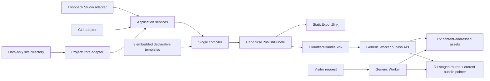

# Mallok 0.1 技术架构

- 状态：Accepted 0.1 architecture
- 日期：2026-08-27
- 产品形态：单仓库、单产品、单 application core；Tier-1 仅附一个窄 Keychain helper

本文取代此前的 workspace monorepo、多 npm package、Node/Worker 双渲染 runtime、可执行 ESM Theme API、D1 内容 revision/pointer 和复杂 deployment fence 设计。旧设计只保留在 Git 历史中，不得据此实现第二套架构。

字段级格式分别由下列文档负责：

- [项目目录格式](PROJECT_FORMAT.md)
- [声明式模板格式](TEMPLATE_FORMAT.md)
- [搜索与页面性能](SEO_PERFORMANCE.md)
- [Cloudflare 数据发布](CLOUDFLARE.md)
- [二进制发行](DISTRIBUTION.md)
- [安全边界](SECURITY.md)

## 1. 核心结论

Mallok 0.1 是一个用 TypeScript 开发、由 Bun 编译成自包含 executable 的本地内容应用。普通用户双击 `Mallok.app`，高级用户运行 `mallok`；两者都在 loopback 打开同一个内置 Studio。CLI 是同一应用能力的另一层 adapter，不是另一套产品。

普通站点目录只有数据：`mallok.json`、`content/`、`media/` 和 Mallok 自己维护的 `.mallok/`。站点不含 `package.json`、`node_modules`、可执行配置、主题代码或插件。

本地 compiler 是唯一渲染 runtime。它把项目数据和一个内置声明式模板编译成 canonical `PublishBundle`：

- 已预渲染的 HTML route body；
- RSS、sitemap 等已生成 feed body；
- 内容寻址的 CSS、图片、字体等 asset；
- 绑定全部 body/asset hash 的 canonical manifest。

static export 和 Cloudflare publish 都是 `PublishBundle` sink。它们只能复制或存储 bundle bytes，不得再次解析 Markdown、执行模板或改变 HTML。

## 2. 系统视图



不变量：

1. Studio 和 CLI 调用相同 application service；两者都不拥有业务规则。
2. compiler 只读取显式项目快照、模板版本和显式 `asOf`，不读取网络、ambient clock 或随机数。
3. compiler 与 bundle contract 只有一套。对同一个显式 `canonicalOrigin` 生成的 bundle 只编译一次，任意兼容 sink 消费相同 bytes；若静态托管 origin 与 Cloudflare origin 不同，它们是同一 compiler 用不同显式输入生成的两个确定 bundle，不伪装成同一 hash。
4. Cloudflare Worker 只按 path 读取预渲染 body 或内容寻址 asset，不运行 Markdown、Liquid-like 模板或站点代码。
5. 普通 publish 只发送 bundle 数据，不上传 Worker code、不执行 D1 migration、不创建或删除云资源。

## 3. 仓库与模块边界

Mallok 源码是一个普通单仓库。仓库为了构建二进制可以有根 `package.json` 和 Bun lockfile；这些开发文件绝不会复制到用户站点。

```text
mallok/
├── package.json
├── bun.lock
├── src/
│   ├── domain/                 # 纯数据类型、不变量、稳定错误码
│   ├── application/            # Studio/CLI 共用 use cases
│   ├── compiler/               # 内容、模板、route、feed、asset -> bundle
│   ├── templates/              # 三个内置声明式模板及解释器
│   ├── adapters/
│   │   ├── project-fs/         # 数据项目读写与快照
│   │   ├── studio-http/        # loopback HTTP/UI adapter
│   │   ├── cli/                # argv/stdout/stderr adapter
│   │   ├── static-export/      # bundle -> directory
│   │   └── cloudflare/         # provision、capability、bundle publish
│   ├── embedded/
│   │   ├── studio/             # 编译后的 Studio 前端资源
│   │   └── cloudflare-worker/  # generic Worker 与 D1 schema
│   └── main.ts                 # 唯一 composition root
├── test/
├── platform/
│   └── macos/keychain-helper/ # 无业务逻辑的 Security.framework bridge
└── docs/
```

依赖方向：

```text
adapters -> application -> domain
compiler -> domain
application -> compiler ports / sink ports
embedded resources -> composition root
```

禁止：

- `domain` 或 `compiler` 导入 Studio、CLI、Cloudflare API、Bun server 或本地绝对路径；
- Studio handler 直接写项目文件或发 Cloudflare 请求；
- CLI command 复制 application use case；
- static/Cloudflare sink 修改 bundle body、route、asset URL 或 manifest；
- 为内部目录建立独立版本、独立 package 或公共插件 API。

`platform/macos/keychain-helper` 是唯一例外的平台 helper：它随同一 release 构建/签名，只实现固定 credential CRUD，不包含 application/domain/compiler/provider 逻辑，也不建立独立版本。

## 4. 单一应用层

0.1 application service 只有下列用户能力：

```ts
interface MallokApplication {
  createProject(input: CreateProjectInput): Promise<ProjectSummary>;
  openProject(path: string): Promise<ProjectSummary>;
  renameProject(input: RenameProjectInput): Promise<ProjectSummary>;
  duplicateProject(input: DuplicateProjectInput): Promise<ProjectSummary>;
  backupProject(input: BackupProjectInput): Promise<BackupResult>;
  restoreBackup(input: RestoreBackupInput): Promise<ProjectSummary>;
  deleteLocalProject(input: DeleteLocalProjectInput): Promise<DeleteResult>;
  updateProject(change: ProjectChange): Promise<ProjectSummary>;
  importMarkdown(input: ImportMarkdownInput): Promise<ImportResult>;
  exportMarkdown(input: ExportMarkdownInput): Promise<ExportResult>;
  validateProject(input: ValidateProjectInput): Promise<ValidationReport>;
  previewProject(input: PreviewInput): Promise<PreviewSession>;
  compileBundle(input: CompileBundleInput): Promise<BundleHandle>;
  exportStatic(input: ExportStaticInput): Promise<ExportResult>;
  connectCloudflare(input: ConnectCloudflareInput): Promise<ConnectionResult>;
  provisionCloudflare(input: ProvisionInput): Promise<ProvisionResult>;
  publishCloudflare(input: PublishInput): Promise<PublishResult>;
  inspectCloudflare(input: InspectInput): Promise<CloudflareStatus>;
  listPublishHistory(input: PublishHistoryInput): Promise<PublishHistory>;
  restorePreviousBundle(input: RestoreInput): Promise<PublishResult>;
  upgradeCloudflareRuntime(input: RuntimeUpgradeInput): Promise<UpgradeResult>;
  checkForApplicationUpdate(input: UpdateCheckInput): Promise<UpdateCheckResult>;
}
```

接口名称是架构示意，不是公共 TypeScript API；0.1 不发布 library exports。实现可以拆成更小 use case，但不得产生 Studio-only 或 CLI-only 业务分支。

adapter 职责：

| adapter | 只负责 |
| --- | --- |
| Studio | loopback HTTP、session、表单/JSON 映射、浏览器展示 |
| CLI | argv、交互确认、TTY/JSON 输出和退出码 |
| ProjectStore | 安全读取/原子写入数据目录、创建一致快照 |
| StaticExportSink | 将 bundle route/asset bytes 原样写入临时目录并原子替换 |
| CloudflareBundleSink | 鉴权、缺失 asset 上传、D1 staging、activate/status |
| CredentialStore | 完成 OAuth PKCE、从 OS credential store 或高级显式环境读取 secret；不写项目 |

## 5. 项目真相与本地状态

`mallok.json`、`content/` 和 `media/` 是作者真相。Cloudflare 只保存某个已编译 bundle 的发布投影，不保存 Markdown、模板源或可反向编辑的内容模型。

`.mallok/` 是非作者真相的本地运行状态：cache、recovery journal、bundle、发布记录、非敏感 provider resource id 和进程锁。删除它不得丢失作者内容或改变线上 current，用户可用项目 `siteId` 和 Cloudflare 凭据重新连接远端；但删除会失去未合并 recovery、发布记录和 cached previous bundle，可能使恢复旧版不可用，因此不是无影响操作。`.mallok/` 不保存 Cloudflare API token、site publish token、cookie 或 Studio session。

ProjectStore 在开始编译时建立只读快照。快照包含所有被消费文件的规范相对路径、bytes、size 和 SHA-256。编译期间文件发生变化时，本轮失败并要求重试，不能混用两个时刻的数据。

具体目录、内容 frontmatter、media URL 和限制见 [PROJECT_FORMAT.md](PROJECT_FORMAT.md)。

## 6. Compiler 与 PublishBundle

compiler 流程固定为：

```text
project snapshot
  -> strict config/content validation
  -> Markdown parse
  -> raw HTML removal + sanitizer
  -> route planning and collision check
  -> declarative template rendering
  -> compiler-owned SEO head injection
  -> HTML5 structural and internal-link validation
  -> RSS/sitemap/robots generation
  -> referenced-media optimization + template asset hashing
  -> URL rewriting
  -> canonical manifest
  -> PublishBundle
```

`CompileBundleInput` 必须区分实际响应使用的 `servingOrigin` 与可选 `publicCanonicalOrigin`。本地预览的前者是当前 loopback origin，后者只在项目已有公开 HTTPS origin 时存在；preview 永远 noindex，且不能把 loopback 写成 canonical。静态导出要求用户先确认 `publicCanonicalOrigin`，Cloudflare 首次连接则使用 provision 后得到的 Worker origin。项目可以在首次预览前没有 `canonicalUrl`，但任何可对外发布或导出的 bundle 都必须有明确 HTTPS public canonical origin；成功首次发布后 Studio 将该 origin 原子写回 `mallok.json`。

同一 compiler 有两个显式 selection profile：`preview` 可以包含当前选中的 draft，`publish` 固定排除全部 draft。两者只改变内容集合，不改变 Markdown 解析、净化、route、模板和 asset 规则；static 与 Cloudflare sink 只接受 `publish` profile 的 bundle。

```ts
interface CompileBundleInput {
  readonly profile: "preview" | "publish";
  readonly servingOrigin: string;
  readonly publicCanonicalOrigin?: string;
  readonly asOf: string;
  readonly projectSnapshot: ProjectSnapshot;
}
```

publish profile 缺少合法 `publicCanonicalOrigin` 时失败；preview 没有它时省略 canonical，同时仍输出 `noindex,nofollow`。head、sitemap、robots、图片优化与 PageSpeed 预算的唯一语义见 [SEO_PERFORMANCE.md](SEO_PERFORMANCE.md)。

### 6.1 Bundle 数据模型

```ts
interface PublishBundleManifestV1 {
  readonly formatVersion: 1;
  readonly siteId: string;
  readonly canonicalOrigin: string; // publish bundle 的 publicCanonicalOrigin
  readonly compilerOutputVersion: number;
  readonly template: Readonly<{ id: string; version: string }>;
  readonly routes: readonly RouteManifestEntry[];
  readonly assets: readonly AssetManifestEntry[];
}

interface RouteManifestEntry {
  readonly path: string;
  readonly status: 200 | 404;
  readonly contentType:
    | "text/html; charset=utf-8"
    | "application/rss+xml; charset=utf-8"
    | "application/xml; charset=utf-8"
    | "text/plain; charset=utf-8";
  readonly cachePolicy: "page" | "feed" | "not-found";
  readonly bodySha256: string;
  readonly bytes: number;
}

interface AssetManifestEntry {
  readonly url: string;       // /assets/<sha256>.<canonical-extension>
  readonly key: string;       // 与 url 去掉前导 / 后相同
  readonly sha256: string;
  readonly bytes: number;
  readonly contentType:
    | "text/css; charset=utf-8"
    | "image/png"
    | "image/jpeg"
    | "image/webp"
    | "image/avif"
    | "image/gif"
    | "font/woff2";
}

interface PublishBundle {
  readonly bundleHash: string;
  readonly manifest: PublishBundleManifestV1;
  readonly routeBodies: ReadonlyMap<string, Uint8Array>;
  readonly assetBodies: ReadonlyMap<string, Uint8Array>;
}
```

manifest 使用 UTF-8 canonical JSON：object key 由固定 serializer 排序，数组按 `path`/`url` 的 Unicode code-unit 升序，禁止浮点非有限值、重复 key、BOM 和非规范 Unicode scalar。`bundleHash = SHA-256(canonicalManifestBytes)`；manifest 已包含每个 body/asset 的 hash，所以无需把大 body 拼进同一次 hash 输入，也不存在自引用字段。`compilerOutputVersion` 只在会改变规范输出语义时递增；完整 Mallok binary 版本属于 bundle provenance，不进入 canonical manifest 或 `bundleHash`。

`bundleHash` 不进入 manifest。执行时间、主机路径、用户名、locale、mtime、Cloudflare resource id 和随机数都不进入 bundle。相同项目快照、Mallok 版本、内置模板版本和 `asOf` 必须产生相同 bundle。

feeds、root sitemap、可选 sitemap shards 和 robots 都是普通 route body，不是 Worker runtime 逻辑。404 也是 manifest 中 path 为 `/404.html`、status 为 404 的预渲染 route。`/sitemap.xml` 在 480 KiB 内可直接是 `urlset`，否则是指向 `/sitemaps/0001.xml` 等 route 的 `sitemapindex`；全部分片仍计入 route budget。

### 6.2 内容寻址 asset

compiler 只处理 published route 实际引用的项目 media。静态图片先按 `SEO_PERFORMANCE.md` 的固定 sharp/libvips profile 自动定向、缩小、清理 metadata 并编码为单一 WebP asset，再按输出 bytes 计算 SHA-256；作者原图不被改写，也不进入公开 bundle。内置模板 CSS/asset 同样按最终 bytes 寻址。HTML、feed 或 config 中的逻辑 `/media/...` 引用在编译时改写；公开内容中的远程图片、动画图片或超出优化预算的图片使 publish profile 失败。

asset URL 一旦发布，其 bytes 和 `Content-Type` 永不改变。0.1 不自动删除 R2 asset；这用少量存储换取没有引用 fence、删除竞态和破图恢复协议。

## 7. 两个 sink，不是两个 runtime

### 7.1 StaticExportSink

static sink 将 route 映射为文件：`/` → `index.html`，尾斜杠 route → `<route>/index.html`，文件 route 原样写入，`/404.html` → `404.html`。asset URL 按相同相对 path 写入。

sink 先写入 output 同父目录下的新 staging 目录，逐项复核 bytes/hash/realpath，再执行 crash-safe promote：现有 output rename 为唯一 backup，staging rename 为 output，成功后删除 backup；任一步中断都在下次启动时根据完整性标记恢复到唯一完整目录。0.1 不宣称跨平台“单次 rename 原子替换非空目录”；Tier 1 macOS 必须通过每个故障点的进程终止测试证明旧或新导出至少有一份完整可恢复。sink 不执行模板或内容选择。

恢复标记 v1 固定如下：

- 先求 output 的 canonical absolute path，再计算 `outputPathHash = SHA-256(UTF-8(path))`；每次导出生成 128-bit CSPRNG `nonce`，以 32 个 lowercase hex 表示；
- 标记位于 output parent，文件名为 `.mallok-export-<outputPathHash>-<nonce>.json`，权限 `0600`；同 parent 的目录名固定为 `.mallok-export-<outputPathHash>-<nonce>.staging` 与 `.mallok-export-<outputPathHash>-<nonce>.backup`；
- 标记是 strict JSON object，只含 `formatVersion:1`、`owner:'mallok-static-export'`、`nonce`、`canonicalOutputPath`、`stagingBasename`、`backupBasename`、`bundleHash`、`newInventoryHash`、可选 `oldInventoryHash` 和 `phase:'prepared'|'backup-created'|'promoted'`；未知字段失败；
- inventory 是目录中全部普通文件的 `(POSIX relative path, bytes, sha256)` canonical JSON 数组，按 path code-unit 升序；目录、mtime、mode 和绝对路径不进入，symlink/junction/special file 使 inventory 无效；`*InventoryHash` 是该 canonical JSON 的 SHA-256；
- marker 与每次 phase 更新都以同目录 temporary file、flush、atomic rename 和 parent-directory sync 写入。marker 永远不进入 staging/output/backup，也不进入导出结果；
- `prepared` 只在新 staging 已完整复核且 output 仍匹配 `oldInventoryHash`（或确认不存在）后写；随后才允许把旧 output rename 为 backup，并把 phase 写成 `backup-created`；staging rename 为 output 后写 `promoted`；只有新 output 再次匹配 `newInventoryHash` 后才可删除 exact backup 和 marker。

恢复必须先验证 marker mode/owner/schema、output parent realpath、三个 exact child basename、nonce 以及现存目录的完整 inventory，任何 rename/delete 前重新验证且拒绝 symlink/junction：

| 观察到的 phase/state | 唯一自动动作 |
| --- | --- |
| `prepared`，无 `oldInventoryHash`、output/backup 不存在、staging=new | 首次导出在 phase update 前中断；将 exact staging promote 为 output，复核 new，再按 `promoted` 收尾 |
| `prepared`，output=old、backup 不存在、staging=new | 保留旧 output，删除 exact verified staging 与 marker，报告“导出未替换，可重试” |
| `prepared`，output 不存在、backup=old、staging=new | 更新导出在 output→backup 后、phase update 前中断；将 exact backup 恢复为 output，复核 old，再删除 exact verified staging 与 marker，报告“导出未替换，可重试” |
| `backup-created`，backup=old、staging=new、output 不存在 | 将 exact staging promote 为 output，复核 new，再进入 `promoted` |
| `backup-created`，output=new、backup=old、staging 不存在 | 视为 phase update 前崩溃，复核后进入 `promoted` |
| `backup-created`，new staging 不完整而 backup=old、output 不存在 | 将 exact backup 恢复为 output，复核 old，删除 marker并报告失败 |
| `promoted`，output=new 且 backup=old 或不存在 | 删除 exact verified backup（若有）与 marker，报告成功 |
| 任何缺失、额外对象、hash/realpath/nonce 不匹配或多义状态 | 不自动 rename/delete；展示 marker 路径、已验证事实和人工恢复步骤 |

上述 sidecar 是有限的单次文件系统恢复证据，不是全局事务日志。两个并发导出仍由 project/output lock 阻止；启动导出/恢复时按 `outputPathHash` 扫描同 parent：0 个 marker 才可开始新事务，恰好 1 个才进入上述恢复矩阵，2 个及以上一律视为多义状态且零自动 rename/delete。发现未完成 marker 时，新导出必须先完成或显式放弃该恢复，不能另起 nonce 猜测覆盖。

### 7.2 CloudflareBundleSink

首次 `provision` 在用户自己的 Cloudflare account 创建一个 generic Worker、一个 D1 database 和一个 R2 bucket，并安装固定 schema、binding 和 site publish secret。

此后 `publish`：

1. 在 D1 为 `bundleHash` 建立 staging manifest、route 与 asset-verification rows；
2. 以有界分块确保 R2 中每个内容寻址 asset 存在并把验证结果写入对应 row；
3. 上传并按 hash 验证预渲染 route body；
4. 验证 route/asset closure 完整、Worker 支持 bundle format；
5. 以 null-safe `expectedCurrentBundleHash` 条件更新把 `site.current_bundle_hash` 原子切换为新 bundle。

普通 publish 不调用 Cloudflare account API，不上传 Worker、不迁移 schema。协议和恢复见 [CLOUDFLARE.md](CLOUDFLARE.md)。

## 8. Generic Worker 读取模型

Worker 公共请求只做：

```text
validate method and raw path
  -> /assets/<hash>.<ext> ? D1 activated-asset lookup -> R2 GET
  -> D1 JOIN current_bundle_hash + exact route path
  -> exact pre-rendered body
  -> missing route: current bundle /404.html body with status 404
```

Worker 不含 Markdown parser、sanitizer、模板解释器、项目 config loader 或站点专用代码。一个 runtime release 可以服务多个由各自 D1/R2 binding 隔离的站点实例，但 0.1 每次 provision 仍创建用户独占资源，不实现 Mallok 多租户控制面。

## 9. 版本与兼容

一个 Mallok release 同时拥有：

- binary version；
- project `formatVersion`；
- `PublishBundle.formatVersion`；
- embedded generic Worker protocol/schema version；
- 三个内置模板版本。

它们在同一仓库、同一 release 中发布，不独立发包。Worker capability endpoint 返回可接受的 bundle format 和最大预算；binary 在上传任何 bytes 前检查兼容。Worker/schema upgrade 只能由用户明确确认的 `upgradeCloudflareRuntime` application use case 执行，Studio 与高级 CLI 调用同一能力；普通 publish 只报告需要升级，不隐式改变运行代码。

0.1 不提供公共 plugin/theme ABI，因此 binary 内部重构不产生额外 semver surface。

## 10. 故障与恢复原则

- 编译失败：无 sink 副作用。
- static 写入失败：旧 output 保留。
- R2 上传中断：重试相同 content hash；已存在同 hash bytes 即 no-op。Mallok 管理的 `assets/` prefix 在 0.1 是 append-only，current bundle 缺 asset 时从本地完整 bundle 重新上传。
- D1 staging 中断：current bundle 不变；重试同 bundle 补齐缺失 body。
- activate response 丢失：查询 current bundle；相同即成功，不同则重试 finalize。
- 两个发布者竞争：activate 使用一个 current-base guard；旧 base 失败并要求用户刷新，不使用 lease、heartbeat 或全局 fence。
- 本地 `.mallok` 丢失：用 `siteId`、remote capability/status 和显式凭据重建非敏感连接状态。
- provision 部分完成：每次 create 成功后先持久化有限 provision receipt 与远端 ownership marker，再进入下一步；重跑只连接 receipt、siteId、provisionId 和远端 marker 一致的资源，不自动删除或接管同名未知资源。

0.1 没有 per-document revision、idempotency ledger、provider-call journal、upload/activation 两阶段 Worker version 协议、repair/rollback 状态机或自动远程删除。

## 11. 安全与隐私

安全最低线见 [SECURITY.md](SECURITY.md)。架构层固定：

- Studio 只绑定 loopback，使用进程随机 session capability 和 exact Origin/Host 校验；
- Markdown/frontmatter/media/HTTP/bundle 都是不可信输入；
- 原始 Markdown HTML 固定禁用；模板变量默认 HTML escape；
- 模板无任意 JS、插件、网络、文件系统或 raw filter；
- project 和 `.mallok` 不保存 credential；
- Studio browser 永远拿不到 Cloudflare OAuth/API credential；
- publish token 只授权单站点 bundle 数据写入，不授权 account resource 管理；
- public Worker 不根据请求执行作者代码或 compiler；
- 默认无遥测。

## 12. 复杂度预算与非目标

0.1 维护预算：

- 1 个源码仓库；
- 1 个发行产品和 executable；
- 1 个 compiler；
- 1 个 bundle format；
- 3 个内置模板；
- 2 个 sink；
- 1 个 Cloudflare runtime/schema；
- 0 个公共 plugin/theme API；
- 0 个站点 npm dependency；
- 0 个自动云资源删除路径。

明确延期：自定义模板上传、任意 JS、plugin marketplace、第三方 runtime/provider sink、在线多人协作、R2 媒体管理 UI、内容 revision 历史、自动 DNS/domain、CI 云端发布、多租户托管控制面和静态增量构建。

新增上述能力必须先有独立产品需求和维护预算；不得用“以后可能需要”扩大 0.1 内部抽象。

## 13. 验证架构

- domain/compiler 单元：规范化、route、Markdown/XSS、template escaping、feed、hash；
- SEO 单元/集成：head、canonical、robots、sitemap 集合/分片/XML、preview/404 noindex 和 broken link；
- 图片单元/集成：自动定向、固定 WebP profile、三段 byte gate、尺寸/loading/fetchpriority、未引用 media 与动画/外部图片；
- project integration：data-only project、原子写入、symlink/path、并发快照；
- bundle golden：同一 fixture 两次编译 canonical bytes/hash 一致；
- sink contract：static 与 Cloudflare staging 都证明消费相同 bundle bytes；
- Studio/CLI parity：同一 application input 得到相同 plan/result/error；
- Worker local：path → current pre-rendered body、404、HEAD、immutable asset；
- publish fault injection：每个 asset/route/finalize 中断点重试后 current 只有旧或新完整 bundle；
- distribution smoke：在无 Bun/Node/package manager 的干净机器运行 binary、打开 Studio、build/export fixture。
- PageSpeed：固定 Chrome/Lighthouse mobile 配置对三模板三类页面各做 5 次顺序 cold run；release staging 另保存 PSI lab 与可用的 CrUX field 证据。
