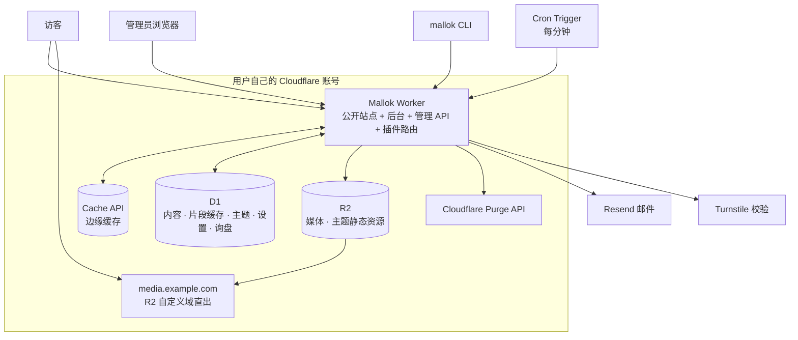

# Mallok 0.1 架构

- 状态：0.1 架构基线（2026-08-28 第二次修订）
- 日期：2026-08-28

本文取代此前的「macOS 桌面 Studio + 构建期预渲染 + Worker 只查表」架构。旧设计只保留在 Git 提交 `2e775cb` 及更早历史中，不得据此实现第二套架构。本次修订在 Cloudflare 原生方向上补入：外贸首垂直带来的多语言、内容类型、媒体、询盘与部署入口设计，以及为 Free 计划 10 ms CPU 预算而设的 D1 派生片段缓存。

## 1. 一句话架构

Mallok 是一个部署到用户自己 Cloudflare 账号的 Worker。内容以 Markdown 存在 D1，媒体存在 R2 并通过 R2 自定义域直出。保存内容时，管理 API 把 Markdown 渲染成与主题无关的 HTML 片段写入 D1 派生缓存；访客请求时，Worker 只做主题模板渲染并写入边缘缓存，绝大多数访客请求由缓存直接返回。同一个 Worker 还提供后台界面、管理 API、首次启动向导和插件路由，CLI 与本地后台通过同一套 API 接入。

## 2. 硬约束（架构的边界条件）

以下取自 Cloudflare 官方文档（2026-08-28 核对），是本架构所有设计决策的前提。**每一条都必须在 Task 01 的 spike 中用真实账号复核，实测结果与本表冲突时先改本文再写代码。**

| 约束 | Free | Paid | 对架构的影响 |
| --- | --- | --- | --- |
| 每请求 CPU 时间 | **10 ms** | 默认 30 s | **所有** Worker 调用都受限，包括管理 API 的保存请求；缓存命中路径必须近乎零成本；Markdown 解析移出访客请求路径 |
| 请求数 | 10 万/天 | 1000 万/月 | 静态资源不计入；图片走 R2 自定义域也不计入 |
| Worker 脚本大小（gzip 后） | 3 MB | 10 MB | 渲染管线 + 模板引擎 + 官方插件必须共同装得下；后台 SPA 走 Static Assets 不占此预算 |
| Worker 启动时间 | 1 s | 1 s | 顶层代码不得做重初始化，主题/模板解析必须惰性 |
| isolate 内存 | 128 MB | 128 MB | 不在内存里缓存整站内容 |
| 子请求（含 Cache API 调用） | 50/请求 | 10,000/请求 | 一次渲染的 D1 + Cache + R2 调用总数必须是小常数 |
| Cron Triggers | **5/账号** | 250/账号 | 每个 Worker 只用 1 个 cron；免费账号最多 5 个站有定时任务 |
| D1 单库大小 | 5 GB 总量 | 5 GB 后计费 | 后台显示用量 |
| D1 行读 / 行写 | 500 万/天，10 万/天；**超出当天不可用** | 250 亿/月，5000 万/月 | 每次渲染的行读必须有界；接近上限要提醒 |
| D1 每次调用查询数 | 50 | 1,000 | 单次渲染的查询数必须是常数级 |
| D1 单行/字符串 | 2 MB | 2 MB | 单篇 Markdown 上限，保存时校验并给出明确错误 |
| D1 单条 SQL 长度 | 100 KB | 100 KB | 批量导入必须分批 |
| R2 | 10 GB-月，100 万写、1000 万读/月，出站免费 | 0.015 美元/GB-月 | 原图默认限制最大边长；变体数量有限 |
| Static Assets | 2 万文件，单文件 25 MiB，请求免费 | 10 万文件 | 后台 SPA 的承载方式 |
| Turnstile | 20 个 widget，每个 10 个主机名 | — | 询盘表单防刷 |
| Purge API | 单文件清除每次 ≤100 个 URL；按标签/主机/前缀/全站清除 5 次/分钟 | 更高 | 清缓存必须合并与去抖 |

已核对的已知坑：

- **Cache API 在自定义域上可用**（官方原文：Workers deployed to custom domains have access to functional cache operations）；仪表盘编辑器与 Playground 预览中无效；**被 Cloudflare Access 挡在前面的 Worker 无法使用 Cache API**。`.workers.dev` 的行为当前文档未明说，必须实测。结论是自定义域是缓存策略的硬前提，`.workers.dev` 只作预览，Access 只能保护 `/_mallok/*` 路径且要实测不影响公开路径缓存。
- **`cache.delete()` 只清除当前数据中心的副本**，不能作为全局失效手段。
- **用 Worker 自定义 cache key 存入的条目无法按 URL 清除**，只能按标签、主机、前缀或全站清除。这直接决定 §6 的方案选择。
- **Email Workers 的发信绑定仅 Paid 可用**且只能发给已验证地址，不能作为询盘邮件通道。

## 3. 系统组成



一个 Worker 按路由前缀分流：

| 路由 | 职责 | 缓存 |
| --- | --- | --- |
| `/*`、`/<locale>/*` | 公开站点渲染 | 边缘缓存 |
| `/sitemap.xml`、`/feed.xml`、`/robots.txt` | 核心内建的 SEO 端点 | 边缘缓存 |
| `/_mallok/setup` | 首次启动向导（完成后自动关闭） | `no-store` |
| `/_mallok/api/*` | 管理 API（认证保护） | `no-store` |
| `/_mallok/preview/<token>` | 草稿签名预览 | `no-store` |
| `/_mallok/p/<plugin>/*` | 插件注册的路由（如询盘提交） | 插件声明，默认 `no-store` |
| `/_mallok/*` | 后台单页应用（Static Assets） | 静态资源自身缓存 |
| `/theme/<id>/<version>/*` | 主题静态资源（Static Assets，随部署产出） | 长缓存，`immutable` |
| `/media/*` | R2 媒体代理，**仅在未配置 R2 自定义域时启用** | 长缓存 |

后台既可以访问线上这个路径，也可以用 `wrangler dev` 跑在本地 localhost——**同一份代码，同一套 API，没有能力差**。

源码结构：

```text
src/
├── core/           # 与 Cloudflare 无关的纯逻辑：渲染管线、内容模型、校验、文章包解析
├── worker/         # Worker 入口、路由、缓存、认证、向导、cron
├── db/             # D1 schema、迁移、查询
├── admin/          # 后台 SPA
├── themes/         # 官方主题（atelier、journal、gazette、manual、folio）
├── starters/       # 官方 Starter（trade-b2b，用 atelier 主题）
├── plugins/        # 插件运行时与官方插件（inquiry）
└── cli/            # CLI（独立发布到 npm）
```

`core/` 不得 import 任何 Cloudflare 类型或全局对象——它必须能在 Node（CLI、测试）、浏览器（后台预览）和 Worker 里同样运行。这是保证 CLI 与 Worker 行为一致的唯一机制。

## 4. 公开请求路径

```
GET /de/products/titanium-bar
 │
 ├─ 0. 插件 onRequest 钩子（重定向、访问控制；默认无）
 │
 ├─ 1. cache.match(request)  ── 命中 ──> 直接返回（目标 < 1 ms CPU）
 │
 └─ 2. 未命中：
      ├─ 一次 D1 batch 取 { site 设置, 当前内容行(含 assets 与片段缓存), 导航/列表所需的有界数据 }
      │   （主题模板不在其中：它随构建打进产物，见 §10）
      ├─ 若片段缓存缺失或过期：现场生成片段（§5 第一阶段）并回写 D1
      ├─ 主题模板渲染成完整页面（§5 第二阶段）
      ├─ 插件 afterRender 钩子
      ├─ 设置 Cache-Control 与 Cache-Tag，cache.put()
      └─ 返回
```

**设计目标：单次冷渲染的 D1 调用是 1 次 batch，其中查询数是常数（目标 ≤ 3），行读有界，与站点内容量无关。** 列表页和导航所需的数据用单独的、有界的查询获取（`LIMIT` 分页），不允许出现「按内容条数循环查询」。**列表页只读取 frontmatter 与摘要字段，永远不解析正文 Markdown。**

主题模板是构建产物的一部分，以字符串形式随 Worker 一起加载；解析后在 isolate 模块级作用域内缓存并复用，isolate 存活期间不重复解析。它不随请求变化，因此没有失效逻辑——换主题就是换一次部署。

## 5. 渲染管线

渲染分两个阶段，边界是「与主题是否相关」：

```
第一阶段：Markdown → HTML 片段（与主题无关，可缓存在 D1）
  D1.content.markdown（标准 Markdown 文本）
    → 分离 YAML frontmatter
    → remark 解析成 mdast（含 GFM）
    → 插件 beforeRender 钩子（可改 AST）
    → 转成 hast
    → 净化（白名单，内容一律视为不可信）
    → 按 assets 映射把 images/、files/ 相对路径替换为 R2 URL，补 srcset / width / height / loading（§8）
    → 序列化成 HTML 片段 + 派生元数据（标题树、摘要、阅读时长、引用与缺失的相对路径列表）
    → 写入 D1 render_cache

第二阶段：片段 → 完整页面（与主题相关，缓存在边缘）
  片段 + 派生元数据
    → 交给主题模板引擎（Liquid），渲染成完整页面
    → 插件 afterRender 钩子（可改最终 HTML）
```

第一阶段**在管理 API 保存内容时执行**（后台保存、CLI 发布、导入均如此），产物写入 `render_cache`；访客请求路径通常只跑第二阶段。片段缓存的键是 `sha256(正文) + frontmatter + 管线版本 + assets 映射（含媒体尺寸与变体）+ 媒体域名 + 已启用插件及其设置的哈希`，任何一项变化即失效并在下一次请求或保存时重建。相对路径在第一阶段就解析成 R2 地址，是为了让访客路径不再解析任何 HTML；代价是换媒体域名会使全部片段失效一次，这是可接受的罕见操作。这样冷渲染的 CPU 只剩 Liquid 模板与字符串拼接，Free 计划的 10 ms 才有把握。

四条不可让步的规则：

1. **内容永远不可信**，即使是管理员写的。净化在生成片段时进行，**不改动 Markdown 原文**——D1 里的 Markdown 必须可原样导出。
2. **同一份 Markdown、同一个管线版本、同一个主题版本，必须渲染出逐字节相同的 HTML。** 渲染函数不得读取时间、随机数或请求特征；`beforeRender` 钩子必须是 (AST, frontmatter, 插件设置) 的纯函数。这是缓存正确性与测试可复现性的前提。
3. **渲染管线整体位于 `core/`，不依赖 Worker 全局对象。** CLI 的本地预览、后台的实时预览和 Worker 的线上渲染跑的是同一个函数。
4. **HTML 不是真相。** `render_cache` 是派生数据，可以随时整表清空，清空后站点仍然正确，只是下一次访问会重建。

保存时的第一阶段同样受 10 ms（Free）约束。若某篇内容在预算内无法完成片段生成，保存请求仍然把 Markdown 存为草稿并返回明确错误（内容过长，需拆分或升级计划），**不得静默失败**。可接受的内容长度上限由 spike 实测后写入 §18。

## 6. 缓存策略

三层缓存，各自解决一个问题：

| 层 | 位置 | 键 | 解决什么 |
| --- | --- | --- | --- |
| 边缘缓存 | Cache API | 请求 URL | 访客请求不进渲染 |
| 片段缓存 | D1 `render_cache` | Markdown 哈希 + 管线版本 + 插件哈希 | 冷渲染不解析 Markdown |
| 模板缓存 | isolate 模块作用域 | 主题 id + version（构建期常量） | 同一 isolate 不重复解析 Liquid |

目标有两个，且互相冲突：访客请求近乎全部命中边缘缓存；内容保存后，公开页面在数秒内更新。

### 6.1 写缓存

渲染完成后 `cache.put()`，`Cache-Control: public, max-age=<site.cache_ttl>`（默认 1 小时，后台可调）。每个响应带 `Cache-Tag` 头，标签集合固定为：`site`、`c:<content_id>`、`k:<kind>:<locale>`（该类型的列表页）、`home:<locale>`、`feed:<locale>`、`sitemap`。列表页与首页带上它们所展示的每条内容的 `c:<id>` 标签。

### 6.2 失效：两个候选，spike 决定

- **方案 A：按标签清除。** 内容保存/删除/定时发布时，管理 API 调用 Cloudflare Purge API 按标签清除：文章本身 `c:<id>`，所在列表 `k:<kind>:<locale>`，`home:<locale>`、`feed:<locale>`、`tag:<locale>`（标签归档跨类型列内容，任何改动都可能影响它）与 `sitemap`，一次保存 6 个标签——**限额是按调用算的，不是按标签，多一个标签不多花一次**。换主题、改导航或站点设置清 `site`。官方文档确认标签清除不受自定义 cache key 影响，因此它同时兼容 §6.3 的退路。代价：Free 计划标签清除 **5 次/分钟**，所以清除必须**合并去抖**（同一 Worker 内 2 秒窗口合并一次调用，一次调用携带多个标签），且每日新闻站连续保存时会排队数十秒——界面要显示「缓存清除排队中」。
- **方案 B：按 URL 清除。** cache key 必须是原始请求 URL（不做自定义 key），管理 API 计算受影响的 URL 列表（文章、列表页各分页、首页、sitemap、feed，通常 ≤ 20 个），单次 ≤ 100 个 URL。额度充足，但 URL 计算逻辑复杂且多语言下容易漏。
- **两个方案都需要**一个带 Zone 级 `Cache Purge` 权限的 API token 和 Zone ID，在向导中配置，存 Worker secret。Zone 的存在再次意味着必须绑定自定义域。

**0.1 默认走方案 A，方案 B 作为备选。Task 01 必须实测两者的可用性、延迟与速率限制并把结论写回本文，不得由实现者临场选一个。**

### 6.3 退路：版本化 cache key

若 A、B 在 spike 中都不可行，退到：cache key 带全站单调递增的 `content_rev`，内容变更时 `content_rev + 1`，旧 key 自然失效，无需 purge。代价是每次请求都要先知道当前 `content_rev`：每请求查一次 D1（增加一次查询和延迟）。不引入 KV（免费档每天 1000 次写不够用）。

### 6.4 不缓存的路径

`/_mallok/*` 全部不进缓存，且必须带 `Cache-Control: private, no-store`。草稿与定时发布未到期的内容永不写入缓存。插件路由默认不缓存。

### 6.5 定时任务

每个 Worker 只用一个 Cron Trigger（`* * * * *`），一次调度内依次执行：到期的定时发布（改状态 + 清缓存）、失败邮件重试、片段缓存与媒体引用的垃圾回收、插件声明的 `scheduled` 钩子。免费账号最多 5 个 cron，站群超过 5 个站需要 Paid，向导与文档要说明。

## 7. 内容模型

概要如下，精确 DDL 在 [DATA_MODEL.md](DATA_MODEL.md)。

| 表 | 作用 | 关键点 |
| --- | --- | --- |
| `site` | 站点设置、语言、导航、SEO 默认值、主题配置项的取值、启用的内容类型 | 单行；**不记录用哪个主题——那由构建决定** |
| `content` | 所有内容类型的条目 | **存 Markdown 原文、frontmatter 和 assets 映射，不存 HTML** |
| `render_cache` | 第一阶段的派生片段与元数据 | 可整表清空 |
| `media` | 媒体元数据 | 文件本体在 R2，此处存 sha、原始文件名、尺寸、类型、变体、引用计数 |
| `redirect` | URL 变更时的重定向 | 保证换 slug 不丢外链 |
| `plugin_state` | 插件启用状态、设置、加密后的第三方密钥 | 官方插件开关即时生效 |
| `admin_user`、`session`、`api_token` | 管理员、后台登录会话与 CLI token | 见 §14 |
| `migration` | schema 版本 | 见 §15 |
| `job` | 定时发布、邮件重试等待办 | 由 cron 消费 |

`content` 的核心字段：`id`（UUID，永不变）、`kind`（由主题声明，见 §10）、`locale`、`translation_group`（同一内容各语言版本共享）、`slug`、`path`（渲染出的公开路径）、`title`、`frontmatter`（JSON，导入别名已归一化）、`markdown`（`index.md` 含 frontmatter 块的完整原文）、`assets`（JSON，相对路径 → media sha）、`status`（`draft` / `scheduled` / `published`）、`published_at`、`updated_at`、`rev`。

**`id` 是内容的身份，`path` 只是当前的公开地址。** 换主题、改 slug、改目录结构都不改变 `id`；`path` 变化时自动写一条 `redirect`。

内容类型不是核心的枚举。核心只认识两种内建类型 `page` 与 `article`；其余（`product`、`category`、`case`、`faq`……）由主题的 `theme.json` 声明，包含每种类型的 frontmatter schema、字段类型（文本、数字、图片、图片列表、键值表、关联内容）与布局。`site.kinds` 记录本站启用的类型；切换到不支持某类型的主题时，该类型内容退回 `page` 布局渲染，后台给出警告，**内容与 URL 不丢失**。

单条 `markdown` 受 D1 的 2 MB 行上限约束，保存时校验并返回明确错误，不允许静默截断。

## 8. 媒体与 R2

- 文件本体存 R2，key 为内容寻址：原图 `media/<sha256>.<ext>`，变体 `media/<sha256>_<width>.webp`（默认宽度 480 / 960 / 1440 / 1920，主题可在 `theme.json` 里收窄）。相同文件不重复存储。
- **Markdown 里写的是相对路径**（`images/hero.jpg`），不是 R2 地址。`content.assets` 记录该条内容里每个相对路径对应的 sha；映射按内容存，两篇文章各有一张 `images/cover.jpg` 互不干扰。第一阶段生成片段时把相对路径替换为 R2 URL 并生成 `srcset` / `sizes` / `width` / `height` / `loading="lazy"` / `decoding="async"`，宽高来自 `media` 表，避免布局抖动。frontmatter 中类型为图片的字段按同一规则解析。
- **图片处理在上传端完成，不在 Worker 里做。** 后台上传时用浏览器 Canvas 转 WebP 并生成变体；CLI 在本地用 `sharp`（CLI 是 Node 进程，不受「无原生库」规则约束）。两端产物**同规格但不保证逐字节一致**，去重键是原图的 sha，因此不影响正确性。
- 原始文件默认保留，但向导提供「原图最大边长 2560」的默认开关以适配 R2 免费额度；关闭后保留真正的原件。
- **媒体通过 R2 自定义域直出**（默认 `media.<站点域名>`，向导用 DNS API 自动创建），图片请求不经过 Worker，不计入 Workers 请求数与子请求数，并享受 Cloudflare 缓存。内容寻址意味着这些 URL 可以永久缓存（`max-age=31536000, immutable`）；换图即换 sha 即换 URL，永远不需要清图片缓存。`.workers.dev` 预览阶段与未配置自定义域时退回 `/media/*` 代理。
- `media.ref_count` 记录被多少条内容的 `assets` 引用；归零的媒体由 cron 延迟回收（默认保留 7 天），后台可见「未使用的媒体」。
- 非图片附件（产品手册 PDF 等）放在文章包的 `files/`，走同一套 sha 寻址与 `assets` 映射，原样存储、按嗅探类型校验、以 `Content-Disposition: attachment` 直出。
- 正文里的外链图片（`https://…`）净化后原样输出，不代理、不下载。
- 引用了 `assets` 中不存在的相对路径是**正常状态而非错误**：内容可以存为草稿，后台与 CLI 显示「缺 N 张图」，发布时警告但不阻止。AI 内容管线产出的 `image-slots.json` 可被 CLI 读取以报告缺图。

文章包格式、相对路径规则与导入导出契约见 [CONTENT_FORMAT.md](CONTENT_FORMAT.md)。

## 9. 多语言

- `site.locales` 声明启用的语言列表与 `site.default_locale`。默认语言的 URL 无前缀，其他语言以 `/<locale>/` 为前缀（`/products/x`、`/de/products/x`）。0.1 各语言共用内容类型的基础路径，slug 按翻译各自设置。
- 每条内容有 `locale`；同一内容的各语言版本共享 `translation_group`。翻译版本是独立的内容行（各自的 Markdown、assets、状态与 URL），不是字段级翻译。
- 渲染上下文向主题提供当前内容的全部可用翻译，主题据此输出语言切换器；核心在 `<head>` 与 sitemap 中自动输出 `hreflang`（含 `x-default` 指向默认语言）。
- 主题的界面文案来自 `theme.json` 声明的语言包（`locales/<locale>.json`），按 `site` 语言与内容 `locale` 选择，缺失时回退到主题默认语言。
- 列表页、首页、feed 按语言分别渲染与缓存（标签 `k:<kind>:<locale>`、`home:<locale>`）。
- 不做的：字段级实时翻译、自动语言检测跳转（SEO 有害）。AI 自动翻译在 0.2 作为 `onContentSave` 插件提供。

## 10. 主题

主题是**声明式的、随构建打进产物的、不含任意 JavaScript 的**模板集合。

```text
src/themes/atelier/
├── theme.json          # 名称、版本、支持的内容类型及其字段 schema、开放的配置项、图片宽度、语言包清单
├── layouts/
│   ├── base.liquid
│   ├── home.liquid
│   ├── page.liquid     # 必需：不被支持的内容类型退回到它
│   ├── article.liquid
│   ├── product.liquid
│   ├── category.liquid
│   └── list.liquid
├── partials/
├── locales/
│   ├── en.json
│   └── zh.json
└── assets/
    └── style.css
```

- 模板与语言包在构建期作为文本模块打进 Worker；`assets/` 复制到 Static Assets 目录，公开路径 `/theme/<id>/<version>/<path>`。**两者都不进 D1。**
- **哪个主题生效由构建决定**（`src/themes/index.ts` 的导出 + wrangler 变量），不是数据库里的一个字段。换主题 = 改源码 + 重新部署。
- 主题**开放的配置项**（`theme.json` 的 `options`）的取值仍存 `site.theme_options`，**在后台随时可改、即时生效**。主题决定有哪些旋钮，运营决定旋钮拧到哪。
- 模板引擎在 Worker 里运行，由内存中的模板映射支撑，没有文件系统：`include` / `render` / `layout` 只能引用主题自身的文件。所有 `{{ }}` 输出默认 HTML 转义，`raw` 过滤器只放行核心标记为安全的 HTML（净化后的正文片段、核心生成的 head 标签），对普通字符串仍然转义。禁止：任意表达式求值、网络访问、原型链访问、未知过滤器。
- 主题能拿到的数据由一份明确的上下文契约定义（站点设置、当前内容与其翻译、有界的内容列表、导航、分页、主题配置项、语言包、插件提供的片段如询盘表单），不是「整个数据库」。
- 主题的配置项与内容类型由 `theme.json` 声明，后台据此自动生成表单。主题作者不写后台代码。
- 主题声明它输出的客户端 JavaScript 为 0 B；如需 JS 必须在 `theme.json` 里列出并说明用途。**这一条在构建期校验**：模板里出现未声明的 `<script>` 或 `on*=` 属性，构建失败。

**切换主题不改变内容 `id`、`translation_group`、已有 URL 与 `redirect` 表。** 切到不支持某内容类型的主题时，该类型的内容用 `page` 布局渲染，`site.kinds` 的 base 不变，URL 不变——所以每个主题都必须有 `page` 布局。

安全定位：主题是**半可信**的。它不能执行代码，但能输出 HTML，而且它进入你的构建产物——审阅一个主题和审阅任何一段进仓库的代码是一回事。因此模板引擎的转义规则与构建期的校验都是安全边界的一部分，不是排版细节。

## 11. Starter

Starter 就是**你 fork 的那个仓库**：主题已经选好、插件已经装好、`wrangler.jsonc` 已经配好，外加一批示例内容（文章包目录）和一份设置预设。

创建站点 = 用这个仓库部署一次，首次启动向导把示例内容与设置导入 D1。官方 Starter `trade-b2b` 提供外贸企业站的完整页面集合：首页、产品分类与详情、关于/工厂/资质、新闻、案例、FAQ、联系与询盘。

导入之后示例内容就是普通内容，和手工录入的没有区别。再次导入属于覆盖操作，需要明确确认。

## 12. 插件

插件是真正的 JavaScript/TypeScript，**官方与第三方走同一条路**：源码进 `src/plugins/`，构建期打包进 Worker。

| 操作 | 怎么生效 |
| --- | --- |
| 安装 / 更新 / 移除插件 | 改源码 + 重新部署 |
| 启用 / 停用已装的插件（`plugin_state.enabled`） | 后台开关，即时生效 |
| 改插件设置与密钥 | 后台表单，即时生效 |

开关只决定要不要跑，不改变打进产物的是什么代码——这是它能即时生效的原因，也是它和「安装」的区别。界面必须把两者分开说。

```text
src/plugins/inquiry/
├── plugin.json     # 名称、版本、钩子、路由、设置项与密钥项、数据表迁移、后台面板、注入的客户端 JS 声明
├── migrations/
│   └── 0001_inquiry.sql
└── index.ts
```

0.1 开放的钩子：

| 钩子 | 时机 | 典型用途 |
| --- | --- | --- |
| `onRequest` | 请求进入，缓存查询之前 | 重定向、访问控制 |
| `beforeRender` | 第一阶段，拿到 AST 之后 | 自定义语法、短代码；必须是纯函数 |
| `afterRender` | 完整 HTML 生成之后 | 注入 meta、结构化数据、表单片段 |
| `onContentSave` | 内容保存时 | 校验、自动摘要、自动翻译、通知外部服务 |
| `scheduled` | 每分钟 cron 调度内 | 重试、同步、清理 |

0.1 开放的六种能力（`plugin.json` 声明，核心提供实现）：

1. **数据表**：插件自带 SQL 迁移，表名以 `p_<plugin>_` 为前缀，由核心的迁移器统一执行与记录。
2. **路由**：`/_mallok/p/<plugin>/<path>`，声明方法、是否缓存、是否需要 Turnstile 校验、限流键。核心提供 body 解析、zod 校验、Turnstile 服务端验证与基于 Workers 限流绑定的限流辅助（该绑定按数据中心计数、最终一致，只用于防刷不用于计费）。
3. **设置与密钥**：普通设置明文存 `plugin_state.settings`；声明为 `secret` 的项用部署时生成的 `MALLOK_SECRET` 以 AES-GCM 加密后存 `plugin_state.secrets`，后台可填写、可轮换，返回体永远不回显。
4. **定时任务**：`scheduled` 钩子，共享站点唯一的 cron。
5. **声明式后台面板**：插件不带前端代码。它声明「设置表单」（按 schema 生成）与「数据表视图」（表、列、筛选、可执行的操作如标记/删除/导出 CSV），由后台 SPA 统一渲染。询盘列表与将来的订单列表都是这种面板。
6. **发邮件**：核心提供 `sendEmail({ to, subject, html, text, replyTo })`，0.1 唯一实现是 Resend（直接 `fetch` 其 HTTP API，不引入 SDK）。发送记录与失败重试由核心的 `job` 表承担。

约束：

- 插件在 `onRequest` / `afterRender` 中的 CPU 开销直接计入访客请求。插件必须声明是否影响片段缓存键、是否注入客户端 JS，后台如实展示。
- 插件跑在用户自己的账号里、拥有 Worker 的全部能力。**插件是可信代码**，安全模型与 WordPress 插件一致：用户为自己安装的东西负责。文档必须讲清楚，不得暗示有沙箱。
- 每新增一个插件都要给出打包体积证据；产物总体积须在 3 MB（Free）内。

## 13. 询盘链路（官方 `inquiry` 插件的参考设计）

```
产品页 / 联系页的原生 HTML <form>（隐藏字段：content_id、locale；蜜罐字段；Turnstile widget）
  → POST /_mallok/p/inquiry/submit
  → zod 校验 → 蜜罐与提交耗时检测 → Turnstile 服务端验证 → 限流
  → 写 D1 p_inquiry_inquiry（来源页面、产品、姓名、邮箱、公司、电话/WhatsApp、留言、request.cf.country、UA、时间）
  → 写两条 job：通知站主（Reply-To 设为买家邮箱）、买家自动回执（按 locale 选模板）
  → 立即尝试发送；失败的由 cron 重试，状态可见
  → 302 到该语言的感谢页（可缓存）
```

后台面板：询盘列表（新 / 已回复 / 垃圾）、详情、标记垃圾、导出 CSV。设置：接收邮箱、发件域名与地址、自动回执开关与模板、垃圾规则（国家、关键词）。向导在填入 Resend key 后，可调用 Cloudflare DNS API 直接写入 SPF/DKIM 记录（域名本来就在同一账号）。询盘数据进入站点整体导出（`inquiries.csv`）。

## 14. 认证与安全边界

| 主体 | 信任级别 | 边界 |
| --- | --- | --- |
| 访客内容（Markdown 正文） | 不可信 | 生成片段时白名单净化 |
| 访客提交（询盘表单） | 不可信 | zod 校验、Turnstile、限流、参数化 SQL、邮件模板转义 |
| 主题 | 半可信 | 受限模板引擎，无代码执行 |
| 插件 | 可信 | 用户主动启用/安装，无沙箱，需明确告知 |
| 管理 API 调用者 | 需认证 | 见下 |

Worker secret 只有三个，都在部署时设置：`MALLOK_SECRET`（随机 32 字节；签发 session、加密第三方密钥、签名预览链接）、`CF_API_TOKEN`（Zone 级 Cache Purge 与 DNS 编辑权限，仅用于清缓存与向导写 DNS）、`CF_ZONE_ID`。**Cloudflare 自身的凭据只进 Worker secret**；第三方服务密钥（Resend 等）加密存 D1 以便后台配置，不进日志、不进返回体。

0.1 的后台认证：

- 首次启动向导设置管理员邮箱与密码，向导完成后 `/_mallok/setup` 永久关闭；
- 密码用 WebCrypto 原生 PBKDF2 派生（不用 Argon2/bcrypt 的 WASM 实现——10 ms CPU 限制下跑不动），参数在 spike 中按实测 CPU 预算确定；
- 登录后签发 session token，存 D1，cookie 为 `HttpOnly; Secure; SameSite=Strict`；
- 所有写操作要求 CSRF token；
- 管理 API 同时接受 Bearer token，供 CLI 使用；token 在后台生成、可撤销、有作用域；
- 可选加强：用 Cloudflare Access 保护 `/_mallok/*` 路径。文档给出配置，但必须先实测它不影响公开路径的 Cache API。

其他：

- 上传文件按嗅探出的真实类型而非扩展名校验，只接受白名单类型；
- 错误响应不泄露 SQL、bucket 名、database id 或堆栈；
- 草稿预览链接由 `MALLOK_SECRET` 签名、带过期时间，响应 `no-store` 且 `noindex`。

## 15. 部署、向导、迁移与升级

三个部署入口（见 PRODUCT_VISION §5.4）汇入同一个首次启动向导；每个站点的资源清单、命名与创建顺序在 [CLOUDFLARE_RESOURCES.md](CLOUDFLARE_RESOURCES.md)：

1. **`npx mallok create`**：调用 wrangler 完成 OAuth 登录、创建 D1 与 R2、生成 `MALLOK_SECRET`、部署 Worker，打印 `.workers.dev` 地址并打开向导。支持 `--starter`、`--domain`、`--locale` 参数以便站群脚本化。
2. **Deploy to Cloudflare 按钮**：官方文档确认它只支持 GitHub/GitLab、要求源仓库公开、按 wrangler 配置自动创建 D1/R2 等资源并接入 Workers Builds。Mallok 仓库需为此提供带默认资源名的 wrangler 配置，且不采用 monorepo 布局。此路径下升级 Mallok 是同步 fork，安装第三方插件是修改配置文件后自动构建。
3. **托管部署助手**（1.0）：官网代为创建资源，不属于 0.1。

**schema 迁移由 Worker 在运行时自行执行**：每次冷启动检查 `migration` 表，落后则在一个 D1 batch 内按序应用（`migration` 表内的锁行防止并发重复执行），插件迁移随之执行。这样三个入口都不依赖 CI 跑迁移，升级 = 部署新版本 Worker。迁移必须向前兼容：迁移期间旧版本 Worker 仍在服务，失败不得让站点不可用。

向导 `/_mallok/setup` 的步骤：管理员账号 → 站点名称与语言 → 选择 Starter → 域名（检测是否已绑定自定义域，未绑定则给出步骤并提示缓存尚未生效）→ 媒体域名（自动创建 `media.<域名>`）→ 邮件（Resend key、发件域名、写入 DNS 记录）→ 完成。每一步可跳过并在设置里补做。

**哪些操作需要重新部署，必须在界面上一次讲清**：

| 不需要部署（后台改完即时生效） | 需要重新部署 |
| --- | --- |
| 内容、媒体、多语言翻译 | 换主题、改主题模板 |
| 站点设置、导航、SEO 默认值 | 安装 / 更新 / 移除插件 |
| 主题开放的配置项 | 升级 Mallok 本身 |
| 插件的启用开关、设置与密钥 | 改 wrangler 配置、加绑定 |

升级前提示用户导出一次备份，并给出 D1 备份方式。

## 16. 内容导入导出

这是「不锁定」承诺的可执行部分，不是附加功能。格式契约在 [CONTENT_FORMAT.md](CONTENT_FORMAT.md)。

- **导出**：一次操作产出按内容类型组织的文章包目录（每个翻译组一个文件夹：`index.md`、`index.<locale>.md`、`images/`、`files/`、`mallok.json`），`index*.md` 是 D1 中的原文逐字节输出，图片与附件按 `assets` 的原始文件名从 R2 取原图放回；另附 `site.json`（设置与导航）、`redirects.csv`、`themes/`（已安装主题的安装包）、`inquiries.csv`（若启用询盘插件）与 `media/`（未被引用的媒体）。frontmatter 只含通用字段；`mallok.json` 是唯一的私有文件，只承载 `id` 与 `translation_group`，其他工具会忽略它。
- **导入**：接受文章包目录；0.1 至少覆盖通用 Markdown 与 Astro Content Collections 的常见 frontmatter 形态；相对路径图片按 §8 上传并建立 `assets` 映射。
- **往返一致性必须有测试**：导出再导入再导出，`index.md` 与图片逐字节一致，`id`、`locale`、`translation_group` 保持不变。这是回归测试的硬性项，不是尽力而为。
- WordPress 导入器与产品 CSV/Excel 导入放在 0.2。

## 17. 明确不做

- 不在 Worker 里做图片处理；
- 不在运行时加载远程代码或动态 `import`；
- 不引入 ORM、通用插件市场运行时、第二个模板引擎、第二套渲染管线；
- **不做运行时安装**：主题与插件都不通过上传包在线安装，因此 Worker 里没有解压、没有包校验、没有安装事务；这些工作全部发生在构建期；
- 不引入 Workers KV 或 Queues（0.1 用不到，Free 额度也不合适）；
- 不做 Mallok 侧的账号、计费、多租户控制面；
- 不做在线协作编辑与内容修订历史 UI（0.1 保留 `rev` 字段但不做界面）；
- 不做字段级翻译与自动语言跳转；
- 不为「以后可能需要」提前抽象出 provider/adapter 层——0.1 只有 Cloudflare 一个目标，邮件也只有 Resend 一个实现（`sendEmail` 是内部函数边界，不是 provider 层）。

## 18. 待验证事项

以下每一条都必须在 Task 01 的 spike 中得到实测结论并写回本文，**在此之前不得当作既定事实实现**：

1. Cache API 在 `.workers.dev` 上是否生效；自定义域是否为硬前提；Cloudflare Access 保护 `/_mallok/*` 路径时公开路径的 Cache API 是否仍然可用。
2. 第二阶段冷渲染（D1 batch + Liquid）在典型产品页与文章页上的实际 CPU 时间；第一阶段片段生成在保存请求内的 CPU 时间随 Markdown 长度的曲线，以及 Free 计划下可接受的内容长度上限。
3. 按标签清除（方案 A）对 Cache API 写入条目是否生效、实际生效延迟、5 次/分钟限制下的去抖策略是否可接受；按 URL 清除（方案 B）在无自定义 key 时的可用性。两者择一并写回 §6。
4. 渲染管线 + 模板引擎 + 官方插件打包后的实际 gzip 体积，对照 3 MB 上限。
5. PBKDF2 在 10 ms CPU 预算下可用的迭代次数，以及这个强度是否可接受。
6. R2 自定义域在免费计划下的可用性、缓存行为与向导自动创建 DNS 记录所需的 token 权限。
7. Deploy to Cloudflare 按钮实际走通一次：资源自动创建、`MALLOK_SECRET` 如何在该路径下生成与设置、Workers Builds 的构建时长。
8. 运行时自迁移在并发冷启动下的正确性（锁行方案是否足够）。
9. Turnstile 服务端验证与 Resend 发送各自的延迟，确认询盘提交在 Free 计划的 CPU 与子请求预算内。
