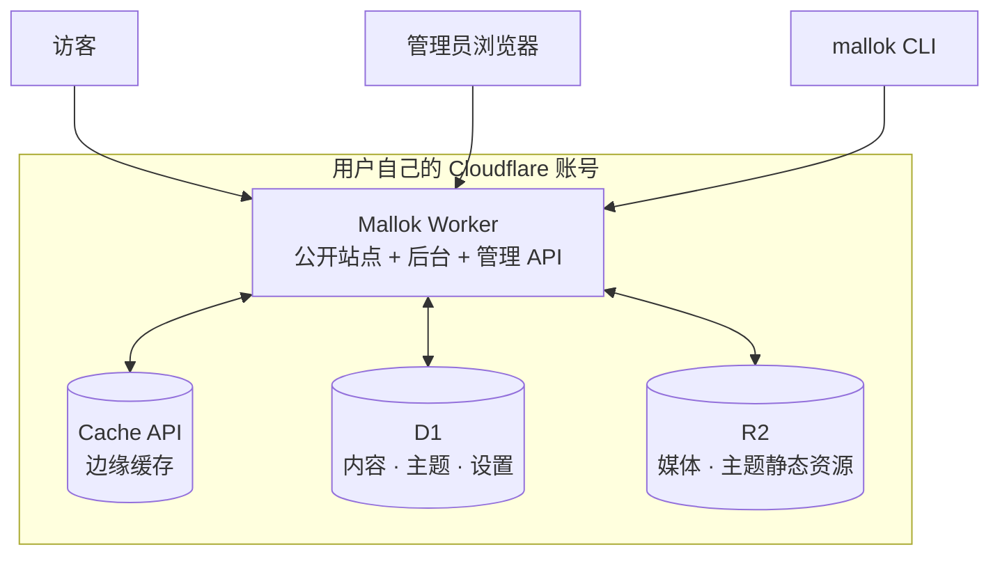

# Mallok 0.1 架构

- 状态：0.1 架构基线
- 日期：2026-08-28

本文取代此前的「macOS 桌面 Studio + 构建期预渲染 + Worker 只查表」架构。旧设计只保留在 Git 提交 `2e775cb` 及更早历史中，不得据此实现第二套架构。

## 1. 一句话架构

Mallok 是一个部署到用户自己 Cloudflare 账号的 Worker。内容以 Markdown 存在 D1，媒体存在 R2。Worker 在请求时把 Markdown 渲染成 HTML 并写入边缘缓存；绝大多数访客请求由缓存直接返回。同一个 Worker 还提供后台界面和管理 API，CLI 与本地后台通过同一套 API 接入。

## 2. 硬约束（架构的边界条件）

以下取自 Cloudflare 官方文档（2026-08-28 核对），是本架构所有设计决策的前提。**每一条都必须在 Task 01 的 spike 中用真实账号复核，实测结果与本表冲突时先改本文再写代码。**

| 约束 | Free | Paid | 对架构的影响 |
| --- | --- | --- | --- |
| Worker 脚本大小（gzip 后） | 3 MB | 10 MB | 渲染管线 + 模板引擎 + 后台 UI 必须共同装得下；插件按需打包 |
| 每请求 CPU 时间 | **10 ms** | 默认 30 s | **缓存命中路径必须近乎零成本；冷渲染在 Free 上可能超限** |
| Worker 启动时间 | 1 s | 1 s | 顶层代码不得做重初始化，主题/模板解析必须惰性 |
| isolate 内存 | 128 MB | 128 MB | 不在内存里缓存整站内容 |
| D1 单库大小 | 500 MB | 10 GB | 单站内容量上限，需在后台显示用量 |
| D1 每次调用查询数 | 50 | 1,000 | 单次渲染的查询数必须是常数级，不能随内容量增长 |
| D1 单行/字符串 | 2 MB | 2 MB | 单篇 Markdown 上限，保存时校验并给出明确错误 |
| D1 单条 SQL 长度 | 100 KB | 100 KB | 批量导入必须分批 |
| 子请求数 | 50 | 10,000 | R2 读取计入，媒体路由要注意 |

两条额外的已知坑：

- **Cache API 在 `.workers.dev` 子域上不生效。** 如果复核属实，绑定自定义域就是缓存策略的硬前提，必须写进部署引导，且 `.workers.dev` 只能定位为预览用途。
- **`cache.delete()` 只清除当前数据中心的副本**，不是全局清除。因此内容更新后的缓存失效不能依赖它，见 §6。

## 3. 系统组成



一个 Worker 承担三个职责，按路由前缀分流：

| 路由 | 职责 |
| --- | --- |
| `/*`（默认） | 公开站点渲染 |
| `/_mallok/api/*` | 管理 API（认证保护） |
| `/_mallok/*` | 后台单页应用（静态资源，随 Worker 打包） |
| `/media/*` | R2 媒体代理 |

后台既可以访问线上这个路径，也可以用 `wrangler dev` 跑在本地 localhost——**同一份代码，同一套 API，没有能力差**。

源码结构：

```text
src/
├── core/           # 与 Cloudflare 无关的纯逻辑：渲染管线、内容模型、校验
├── worker/         # Worker 入口、路由、缓存、认证
├── db/             # D1 schema、迁移、查询
├── admin/          # 后台 SPA
├── themes/         # 官方主题
├── plugins/        # 插件与插件运行时
└── cli/            # CLI（独立发布到 npm）
```

`core/` 不得 import 任何 Cloudflare 类型或全局对象——它必须能在 Node（CLI、测试）和 Worker 里同样运行。这是保证 CLI 与 Worker 行为一致的唯一机制。

## 4. 公开请求路径

```
GET /blog/hello
 │
 ├─ 1. cache.match(cacheKey)  ── 命中 ──> 直接返回（目标 < 1 ms CPU）
 │
 └─ 2. 未命中：
      ├─ 一次 D1 查询取 { 内容, 站点设置, 激活主题的全部模板 }
      ├─ Markdown → HTML（解析 + 净化）
      ├─ 主题模板渲染成完整页面
      ├─ 插件 afterRender 钩子
      ├─ cache.put(cacheKey, response)
      └─ 返回
```

**设计目标：单次冷渲染的 D1 查询数是常数（目标 1 次，上限 3 次），与站点内容量无关。** 列表页和导航所需的数据用单独的、有界的查询获取，不允许出现「按内容条数循环查询」。

主题模板一旦从 D1 读出，在 isolate 模块级作用域内按 `theme_id + theme_rev` 缓存并复用；isolate 存活期间不重复解析。`theme_rev` 变化时自动失效。

## 5. 渲染管线

```
D1.content.markdown (标准 Markdown 文本)
  → 分离 YAML frontmatter
  → remark 解析成 mdast（含 GFM）
  → 插件 beforeRender 钩子（可改 AST）
  → 转成 hast
  → 净化（白名单，内容一律视为不可信）
  → 序列化成 HTML 片段
  → 交给主题模板引擎，渲染成完整页面
  → 插件 afterRender 钩子（可改最终 HTML）
```

三条不可让步的规则：

1. **内容永远不可信**，即使是管理员写的。净化在渲染管线里，不在保存时——保存时净化会破坏「Markdown 原文可原样导出」这个承诺。
2. **同一份 Markdown 加同一个主题版本，必须渲染出逐字节相同的 HTML。** 渲染函数不得读取时间、随机数或请求特征。这是缓存正确性与测试可复现性的前提。
3. **渲染管线整体位于 `core/`，不依赖 Worker 全局对象。** CLI 的本地预览和 Worker 的线上渲染跑的是同一个函数。

## 6. 缓存策略

这是本架构最关键、也最需要实测验证的部分。目标有两个，且互相冲突：

- 访客请求近乎全部命中缓存（否则 Free 计划的 10 ms CPU 撑不住冷渲染）；
- 内容保存后，公开页面在数秒内更新（否则「改完即时生效」这条核心承诺不成立）。

### 6.1 0.1 方案：Cache API + 全局 purge

- **写缓存**：渲染完成后 `cache.put()`，`Cache-Control` 设一个较长的 max-age（默认 1 小时，可在设置里调）。
- **失效**：内容保存/删除/主题切换时，管理 API 调用 **Cloudflare 官方 Cache Purge API**，按 URL 精确清除受影响的页面（文章本身、它所在的列表页、首页、sitemap）。这是真正的全局清除，不受 `cache.delete()` 只作用于本地数据中心的限制。
- **代价**：需要一个带 `Cache Purge` 权限的 API token 和 Zone ID，在部署引导中配置。Zone 的存在再次意味着**必须绑定自定义域**。

### 6.2 备选方案：版本化 cache key

若 §6.1 在 spike 中被证明不可行（token 权限过重、purge 有速率限制、或用户不愿绑域名），退到：

- cache key 中带一个全站单调递增的 `content_rev`；
- 内容变更时 `content_rev + 1`，旧 key 自然失效，无需 purge；
- 代价是 Worker 每次请求都要先知道当前 `content_rev`。这个值要么每请求查一次 D1（增加一次查询和延迟），要么放进 Workers KV（引入第四个服务依赖）。

**0.1 默认走 §6.1，§6.2 作为已设计好的退路。Task 01 必须实测两者并把结论写回本文，不得由实现者临场选一个。**

### 6.3 不缓存的路径

`/_mallok/*` 全部不进缓存，且必须带 `Cache-Control: private, no-store`。草稿状态的内容永不写入缓存。

## 7. D1 数据模型

概要如下，精确 DDL 在 `docs/DATA_MODEL.md`（第二批文档）中定义。

| 表 | 作用 | 关键点 |
| --- | --- | --- |
| `site` | 站点设置、导航、SEO 默认值、激活主题及其选项 | 单行 |
| `content` | 页面与文章 | **存 Markdown 原文和 frontmatter，不存 HTML** |
| `media` | 媒体元数据 | 文件本体在 R2，此处存 key、尺寸、alt、类型 |
| `theme` | 已安装主题的清单与模板文件 | 模板是文本，随主题版本整体替换 |
| `redirect` | URL 变更时的重定向 | 保证换 slug 不丢外链 |
| `session` | 后台登录会话 | 见 §11 |
| `migration` | schema 版本 | 见 §13 |

`content` 的核心字段：`id`（UUID，永不变）、`kind`（`page` / `article`）、`slug`、`path`（渲染出的公开路径）、`title`、`frontmatter`（JSON）、`markdown`（原文）、`status`（`draft` / `published`）、`published_at`、`updated_at`、`rev`。

**`id` 是内容的身份，`path` 只是当前的公开地址。** 换主题、改 slug、改目录结构都不改变 `id`；`path` 变化时自动写一条 `redirect`。

单条 `markdown` 受 D1 的 2 MB 行上限约束，保存时校验并返回明确错误，不允许静默截断。

## 8. 媒体与 R2

- 文件本体存 R2，key 为内容寻址（`media/<sha256>.<ext>`），相同文件不重复存储。
- **图片处理在上传时的浏览器端完成**，不在 Worker 里做。后台上传时用 Canvas 转出 WebP 并生成若干宽度的变体，再一起传到 R2。这样既拿到了优化后的产物，又不用把 `sharp` 这类原生库塞进 Worker（它根本跑不起来），也不引入 Cloudflare Images 这个付费依赖。
- 原始文件默认保留，保证用户能取回自己上传的东西。
- `/media/*` 路由从 R2 读取并加长缓存头；内容寻址意味着这些 URL 可以永久缓存。
- CLI 上传走同一套 API，图片处理在 CLI 本地完成，产物与浏览器端保持一致。

## 9. 主题

主题是**声明式的、运行时加载的、不含任意 JavaScript 的**。

```text
themes/journal/
├── theme.json          # 名称、版本、开放的配置项及其类型和默认值
├── layouts/
│   ├── base.liquid
│   ├── post.liquid
│   ├── page.liquid
│   └── list.liquid
├── partials/
│   ├── header.liquid
│   └── footer.liquid
└── assets/
    └── style.css
```

- 安装时，模板文本写入 D1 的 `theme` 表，`assets/` 上传到 R2。
- **切换主题只改 `site.theme_id`，即时生效，不需要重新部署 Worker。**
- 模板引擎在 Worker 里运行，只开放白名单内的标签与过滤器。禁止：任意表达式求值、网络访问、文件系统访问、raw/unescaped 输出、动态 include 路径。
- 主题能拿到的数据由一份明确的上下文契约定义（站点设置、当前内容、内容列表、导航、分页），不是「整个数据库」。
- 主题的配置项由 `theme.json` 声明，后台据此自动生成表单。主题作者不写后台代码。

安全定位：主题是**半可信**的。它不能执行代码，但能输出 HTML。因此模板引擎的转义规则和输出白名单是安全边界的一部分，不是排版细节。

## 10. 插件

插件是真正的 JavaScript/TypeScript，**在构建期打包进 Worker**。

```text
plugins/sitemap-plus/
├── plugin.json     # 名称、版本、声明使用的钩子、声明需要的设置项
└── index.ts
```

0.1 计划开放的钩子：

| 钩子 | 时机 | 典型用途 |
| --- | --- | --- |
| `onRequest` | 请求进入，缓存查询之前 | 重定向、A/B、访问控制 |
| `beforeRender` | 拿到内容与 AST，渲染之前 | 自定义语法、注入数据、短代码 |
| `afterRender` | 完整 HTML 生成之后 | 注入 meta、结构化数据、分析脚本 |
| `registerRoute` | 启动时 | 新增公开路由（RSS 变体、自定义端点） |
| `onContentSave` | 内容保存时 | 校验、自动生成摘要、通知外部服务 |
| `registerAdminPanel` | 启动时 | 在后台增加设置面板 |

约束：

- **安装或更新插件需要重新部署 Worker。** 这是 Cloudflare 运行时的客观限制（Worker 不能在运行时 import 远程代码），产品必须如实呈现，不得用界面假装它是热插拔的。
- 插件在 `onRequest` / `afterRender` 中的 CPU 开销直接计入访客请求。插件必须声明是否会影响缓存命中，产品要能显示「装了这些插件后冷渲染耗时是多少」。
- 插件跑在用户自己的账号里、拥有 Worker 的全部能力。**插件是可信代码**，安全模型与 WordPress 插件一致：用户为自己安装的东西负责。文档必须讲清楚，不得暗示有沙箱。

## 11. 认证与安全边界

| 主体 | 信任级别 | 边界 |
| --- | --- | --- |
| 访客内容（Markdown 正文） | 不可信 | 渲染时白名单净化 |
| 主题 | 半可信 | 受限模板引擎，无代码执行 |
| 插件 | 可信 | 用户主动安装，无沙箱，需明确告知 |
| 管理 API 调用者 | 需认证 | 见下 |

0.1 的后台认证：

- 部署时设置管理员邮箱与密码；
- 密码用 WebCrypto 原生 PBKDF2 派生（**不用 Argon2/bcrypt 的 WASM 实现——10 ms CPU 限制下跑不动**），参数在 spike 中按实测 CPU 预算确定；
- 登录后签发 session token，存 D1，cookie 为 `HttpOnly; Secure; SameSite=Strict`；
- 所有写操作要求 CSRF token；
- 管理 API 同时接受 Bearer token，供 CLI 使用；token 在后台生成、可撤销、有作用域。
- 可选加强：推荐用户在 Cloudflare Access 前面再挡一层，文档给出配置，但不作为必需。

其他：

- 上传文件按嗅探出的真实类型而非扩展名校验，只接受白名单类型；
- 错误响应不泄露 SQL、bucket 名、database id 或堆栈；
- 部署所需的 Cloudflare API token 只存在于 Worker secret，不进 D1、不进日志、不返回给前端。

## 12. 内容导入导出

这是「不锁定」承诺的可执行部分，不是附加功能。

- **导出**：一次操作产出一个标准的 `.md` 文件目录加 `media/`，frontmatter 是通用字段（`title`、`date`、`slug`、`tags`、`description`），不含 Mallok 私有结构。产物可以直接被 Astro、Hugo、Obsidian 使用。
- **导入**：接受一个 Markdown 文件夹；0.1 至少覆盖通用 Markdown 与 Astro Content Collections 的常见 frontmatter 形态。
- **往返一致性必须有测试**：导出再导入，内容与 `id` 逐字节一致。这是回归测试的硬性项，不是尽力而为。
- WordPress 导入器价值很高，但按 0.1 范围放在紧随其后的版本，不塞进 0.1 稀释核心闭环。

## 13. 部署与升级

- 首次部署由引导流程完成：OAuth 或 API token 授权 → 创建 D1、R2、Worker 并绑定 → 应用 schema → 设置管理员账号 → 引导绑定自定义域。
- **Worker 升级和内容更新是两件不同的事**，界面上必须分开：改内容不需要部署，装插件和升级 Mallok 需要部署。
- schema 迁移前置向前兼容检查；迁移失败不得让站点不可用——迁移期间旧版本 Worker 仍在服务。
- 升级前提示用户导出一次备份，并给出 D1 备份方式。

## 14. 明确不做

- 不在 Worker 里做图片处理；
- 不在运行时加载远程代码或动态 `import`；
- 不引入 ORM、通用插件市场运行时、第二个模板引擎、第二套渲染管线；
- 不做 Mallok 侧的账号、计费、多租户控制面；
- 不做在线协作编辑与内容修订历史 UI（0.1 保留 `rev` 字段但不做界面）；
- 不为「以后可能需要」提前抽象出 provider/adapter 层——0.1 只有 Cloudflare 一个目标。

## 15. 待验证事项

以下每一条都必须在 Task 01 的 spike 中得到实测结论并写回本文，**在此之前不得当作既定事实实现**：

1. Cache API 在 `.workers.dev` 上是否确实不生效；自定义域是否为硬前提。
2. 冷渲染（D1 查询 + Markdown 解析 + 模板渲染）在典型文章上的实际 CPU 时间；Free 计划的 10 ms 是否可行，不可行时产品如何呈现。
3. Cache Purge API 的 token 权限范围、速率限制，以及一次内容保存需要 purge 的 URL 数量是否可控。
4. 渲染管线 + 模板引擎 + 后台 SPA 打包后的实际体积，对照 3 MB / 10 MB 上限。
5. PBKDF2 在 10 ms CPU 预算下可用的迭代次数，以及这个强度是否可接受。
