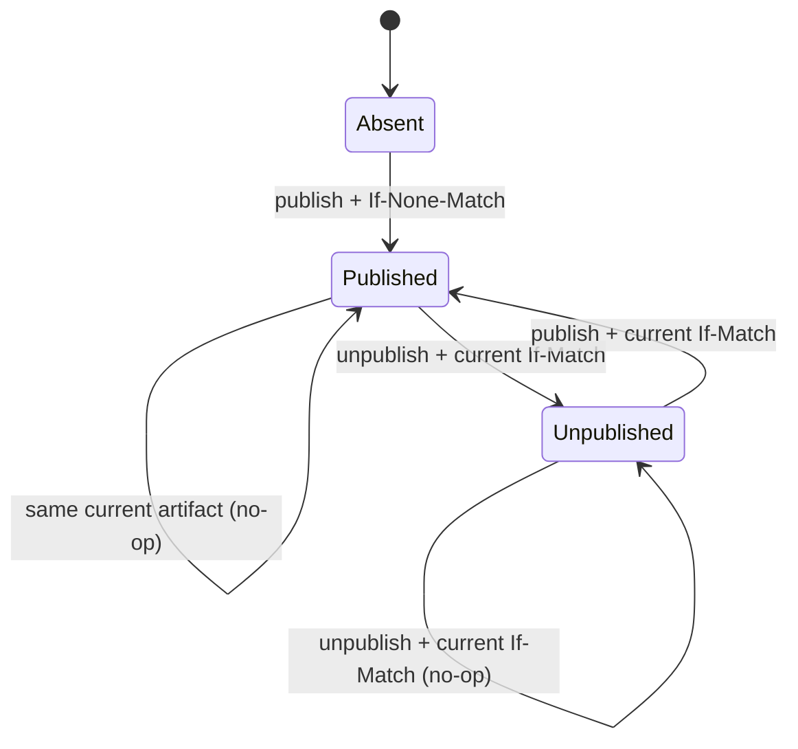

# Mallok HTTP API 契约

- 状态：Accepted for MVP
- 版本：v1 / 文档 0.1
- 适用阶段：Phase 2A–3

本文是 Mallok Cloudflare target 的公开 HTTP 行为和管理 API wire contract。数据库状态、CAS batch、revision codec 与 idempotency 持久化见 [D1 数据库契约](DATABASE.md)；内容字段规范见 [配置与内容契约](CONTENT_CONFIG.md)。

本文中的 MUST、MUST NOT、SHOULD 按规范性要求理解。未列出的 endpoint、请求字段和状态转换不属于 MVP。

## 1. 通用约定

- 生产环境只通过 HTTPS 提供服务；HTTP 到 HTTPS 的重定向由站点域名/Cloudflare 配置负责。
- 管理 API base path 固定为 `/__mallok/api/v1`，该前缀不得被主题或静态资源占用。
- JSON 使用 UTF-8、`application/json`，对象 key 大小写敏感。
- 所有 response、ETag view 和持久化系统时间必须是 canonical UTC `YYYY-MM-DDTHH:mm:ss.sssZ`。ContentInput request 的 `publishedAt/updatedAt` 可接受 RFC 3339 带时区 offset、可省略小数秒；服务端先解析并规范化为 canonical UTC，非法或无时区输入返回 422。
- UUID 均为 lowercase canonical RFC 9562 UUID v4。
- hash 均为 SHA-256 小写 64 位 hex。
- 每个 Worker 请求在开始时固定一个 `asOf`；同一请求内的列表、主题、RSS 和 sitemap 查询使用同一个值。
- 服务端接受有效的 `X-Request-Id`：`[A-Za-z0-9._:-]{8,128}`。缺失或非法时生成 UUID v4。所有管理响应、公开错误和 `no-store` cache-busted 响应返回最终 `X-Request-Id`；可由边缘直接命中的公开缓存响应不承诺逐请求回显，因为该请求可能不执行 Worker。
- 公开响应不得泄漏管理 API、SQL、堆栈、binding、账号或数据库标识。
- API v1 服务器拒绝未知请求字段，response 必须精确满足当前版本 OpenAPI 中 `additionalProperties: false` 的 schema。MVP 不承诺客户端可忽略未知 response 字段；增加 response 字段也需先更新 OpenAPI/文档版本与 consumer tests，删除字段、改变字段含义或改变状态码语义必须发布新的 API major path。

## 2. 路由优先级

Worker/Static Assets 路由顺序固定如下：

1. `/__mallok/api/v1/*`：Worker 优先，永不进入静态资源 fallback。
2. `/articles/*`、`/`、`/rss.xml`、`/sitemap.xml`、`/404.html`：cloudflare assets 不生成同名文件，因此 asset-first miss 后进入 Worker；前四类按下文读取 D1 发布投影，`/404.html` 只用主题渲染 404，不读取 D1。
3. `/assets/*` 和其他已部署 public/theme 文件：由 Workers Static Assets 直接返回，不查询 D1。
4. 其余路径先尝试静态资源；不存在时由 Worker 返回主题 404。

cloudflare target 不得在静态资源目录生成 `index.html`、`articles/**/index.html`、`rss.xml`、`sitemap.xml` 或 `404.html`，避免 asset-first 绕过发布投影。

## 3. 公开路由

| Method | Path | 成功行为 |
| --- | --- | --- |
| `GET`, `HEAD` | `/` | 当前可见文章前 20 条的主题首页 |
| `GET`, `HEAD` | `/articles/<slug>/` | 当前公开且在 `asOf` 可见的文章 |
| `GET`, `HEAD` | `/articles/<slug>` | `308` 到带尾斜杠的 canonical URL |
| `GET`, `HEAD` | `/rss.xml` | 当前可见文章中最新 50 条的 RSS 2.0 |
| `GET`, `HEAD` | `/sitemap.xml` | 首页 + 全部当前可见文章；MVP published document 上限 10,000 |
| `GET`, `HEAD` | `/404.html` | 主题 404 文档，HTTP status 仍为 `404` |

其他 method 返回 `405` 并携带 `Allow: GET, HEAD`。`HEAD` 的 status 和 headers 必须与相同 `GET` 一致，但不发送 body。

### 3.1 路径规范

- `<slug>` 必须已经是 1–100 字符的小写 ASCII kebab-case 单段。
- 在任何 D1/ASSETS 查询前检查可观察的 raw pathname：malformed percent escape，或 encoded slash/backslash、NUL、ASCII control、dot segment 返回主题 400。
- raw URL 语法有效但文章 path 非 canonical（其他 percent encoding、明文反斜杠、空段、重复斜杠、非法 slug 或额外 segment）返回主题 404，不做解码后重定向。
- 不存在、unpublished、future `publishedAt` 和非法 slug 对外都返回同一主题 404；响应不得指出是哪一种状态。
- 不带 query 的 `/index.html` 返回 `308 Location: /`；不带 query且语法合法的 `/articles/<slug>` 才返回 canonical 308。
- redirect candidate 带任何 query 时按下一节先返回 400，不保留或规范化 query。

### 3.2 Query 与 cache-bust

Worker 管理的动态 route（`/`、canonical article、RSS、sitemap）只接受下面定义的唯一 `__mallok_rev`；其他参数（包括 UTM）、重复参数、空参数名或 redirect candidate 上的任何 query 都在 redirect/D1 前返回 400。主题 canonical URL 始终无 query。这个收窄避免随机 query 形成无界动态 cache key并放大 D1；tracking gateway 不属于 MVP。

已经存在的 theme/public 静态资源由 Cloudflare asset-first 在 Worker 前处理，其 query 行为由平台负责，Mallok 不宣称能在 Worker 中拒绝，也不会因此查询 D1。其他未知 path 在 Static Assets miss 后进入 Worker 404；它们的 query 不改变 404 内容。若未来要求全站统一 query policy，必须改为 worker-first 并重新评估请求成本，不能在当前配置下伪称已实现。

publish 成功响应会提供：

```text
<public-url>?__mallok_rev=<artifact-hash>
```

`__mallok_rev` 在 Worker 已识别的 canonical dynamic route 上最多出现一次，且值必须是 64 位小写 hex；缺值、重复或非法值返回 400，并且 D1 与 Worker 代码显式发起的 `env.ASSETS.fetch` 调用数为 0。redirect candidate 带任何 query 也返回 400。未知 path 即使带此参数仍保持主题 404；已经被 asset-first 命中的静态资源不会进入 Worker，因此不适用这条 400 规则。携带唯一合法 `__mallok_rev` 的请求：

- 仍读取当前 published pointer；
- 若启用 D1 read replication，整个请求使用 `withSession("first-primary")`（或锁定版本的等价强一致入口），确保 publish 提交后的验证不从旧 replica 读取；普通无 cache-bust 公开请求才允许 replica；
- 不允许读取旧 revision；
- 文章 route 无 current pointer 时返回 404；pointer 存在时要求其 artifact hash 与参数相同，不同则返回 409 通用验证失败，不能返回旧文章；首页/RSS/sitemap 只把它作为 no-store cache-bust，不做单文章 hash 比较；
- 返回 `Cache-Control: no-store`；
- 必须在 publish transaction 提交后看到当前投影，D1 暂时不可用时返回明确 503，不能回退到旧缓存。

在上述 Worker 动态 routes 上，所有其他 query 都被拒绝，不存在“忽略但进入不同动态 cache key”的行为。

### 3.3 公开响应 headers

正常动态响应至少包含：

```text
Content-Type: text/html; charset=utf-8
Content-Language: <site.language>
Cache-Control: public, max-age=0, s-maxage=60, must-revalidate
ETag: W/"mallok-v1-<response-sha256>"
X-Mallok-Projection: <non-negative-integer>
X-Content-Type-Options: nosniff
```

RSS 使用 `application/rss+xml; charset=utf-8`，sitemap 使用 `application/xml; charset=utf-8`。HTML 响应另带：

```text
Link: <https://canonical.example/path/>; rel="canonical"
```

文章 200 响应还必须包含：

```text
X-Mallok-Revision: <revision-uuid>
X-Mallok-Artifact: <artifact-hash>
```

`X-Mallok-Projection` 只用于诊断，不能代替 ETag。未来 `publishedAt` 会在没有写操作时改变可见集合。

### 3.4 公开 ETag 与条件请求

公开 ETag 是弱 ETag：

```text
W/"mallok-v1-" + SHA-256(最终未压缩响应 body 的 UTF-8 字节)
```

因此主题、配置、可见集合或正文只要改变最终字节就会改变 ETag。自动压缩不改变该弱 validator；响应应携带 `Vary: Accept-Encoding`。

`If-None-Match` 支持 `*`、单值和逗号分隔值。弱比较命中当前 ETag 时返回 304、空 body，并保留 `ETag`、`Cache-Control`、`X-Mallok-Projection` 以及适用的 revision/artifact headers；若该 304 由 Worker 生成而非边缘缓存直接生成，也返回 `X-Request-Id`。公开路由不接受 `If-Match` 作为内容选择器。

### 3.5 公开失败

- 内容不存在或不可见：主题 404，status `404`，可使用正常 60 秒公开缓存。
- query 语法错误：主题 400，status `400`，`Cache-Control: no-store`。
- cache-bust artifact 与当前 pointer 不匹配：主题 409，`Cache-Control: no-store`。
- 公开 method 不支持：主题 405，`Allow: GET, HEAD`，`Cache-Control: no-store`。
- 两个不带 query 的合法 308 canonical redirect：`Cache-Control: public, max-age=300`。
- revision codec、D1 或版本不兼容：主题 503；RSS/sitemap 返回简短 UTF-8 文本，全部 `Cache-Control: no-store`。
- 主题渲染内部失败：通用 500 页面，`Cache-Control: no-store`。

错误页面不包含错误 cause、正文、SQL、堆栈或数据库字段。

## 4. 管理 API 总则

管理 endpoint：

| Method | Path | 作用 |
| --- | --- | --- |
| `GET` | `/__mallok/api/v1/documents` | 分页列出 document 状态 |
| `GET` | `/__mallok/api/v1/documents/:id` | 获取一个 document 状态和 ETag |
| `POST` | `/__mallok/api/v1/documents/:id/publish` | 服务端校验、编译并 publish |
| `POST` | `/__mallok/api/v1/documents/:id/unpublish` | 删除当前 published pointer |
| `GET` | `/__mallok/api/v1/health` | 检查 runtime、codec 与 D1 兼容性 |

管理路径必须精确匹配，不做尾斜杠 redirect。未知 endpoint 返回 JSON 404；不支持的 method 返回 JSON 405 和准确 `Allow`。

所有管理响应包含：

```text
Cache-Control: no-store
Pragma: no-cache
Content-Type: application/json; charset=utf-8
X-Content-Type-Options: nosniff
X-Request-Id: <request-id>
```

管理 API 不设置 cookie，不接受 query/header 中的 token，不发送 CORS allow headers。浏览器跨源调用和 `OPTIONS` preflight 不属于 MVP，返回 405。

若 `Accept` 缺失、包含 `*/*` 或 `application/json`，返回 JSON；若明确排除 JSON，返回 406 `NOT_ACCEPTABLE`。

## 5. 管理认证

唯一凭据来自 Worker secret：

```text
MALLOK_ADMIN_TOKEN
```

secret 必须采用带前缀的唯一编码，二选一：`hex:` 后接 32–128 raw bytes 的小写十六进制（即 64–256 个 hex 字符、偶数长度），或 `b64u:` 后接同样 32–128 raw bytes 的 RFC 4648 URL-safe、无 padding Base64。运行时必须 decode，验证 raw length，再以同一格式 canonical re-encode 并要求字节完全相同；空白、混合大小写 hex、Base64 padding、非 canonical 尾位和其他前缀一律拒绝。未配置或格式不合规时整个管理 API（包括 health）返回 503 `ADMIN_DISABLED`；公开站仍可读取兼容的发布投影。官方生成器固定从 CSPRNG 取得 32 个 raw bytes 后编码；运行时不对现成值伪造“熵估算”，也不维护主观字符串黑名单。

每个管理请求必须提供恰好一个 header：

```text
Authorization: Bearer <token>
```

认证 scheme 大小写不敏感；scheme 与 token 之间恰好一个或多个 SP，token 本身不得含空白。实现计算配置 token 和请求 token 的 SHA-256，对固定长度 digest 做常量时间比较，不直接比较原字符串。

- 缺失或格式错误：401 `AUTH_REQUIRED`；
- token 不匹配：401 `AUTH_INVALID`；
- 401 响应包含 `WWW-Authenticate: Bearer realm="mallok-admin"`。

认证在读取 request body、查询 document、检查幂等键或编译内容之前完成。日志只记录认证结果码，不记录 header、token 或摘要。

## 6. Request body 与 2 MiB 上限

任何带 body 的管理请求都受以下统一限制：

```text
MAX_ADMIN_BODY_BYTES = 2 * 1024 * 1024 = 2,097,152 bytes
```

计算对象是 `Content-Encoding: identity` 下实际读取的 body 字节。MVP 不接受压缩 request body；存在非 `identity` 的 `Content-Encoding` 返回 415。

处理规则：

1. `Content-Length > 2,097,152` 时在读取 body 前返回 413。
2. 对缺失或不可信的 `Content-Length`，流式读取至最多 2,097,153 字节；超过上限立即取消 reader 并返回 413。
3. body 使用 fatal UTF-8 解码；非法字节返回 400。
4. publish 要求 `Content-Type: application/json`，可带唯一参数 `charset=utf-8`；其他 media type 返回 415。整个 request 的 2 MiB 门通过后，规范化 `bodyMarkdown` 仍受 Cloudflare target 的 262,144 UTF-8 bytes 上限；这是字节限制，不是 JSON Schema 字符数。
5. JSON top-level 必须是 object；拒绝重复 key、尾随数据、未知字段及非 JSON 数值。
6. unpublish 要求空 body；任何非零 body 返回 400，且不要求 `Content-Type`。
7. GET/HEAD 请求必须无 body；存在 body 返回 400。

大小错误和 JSON parser 错误不得回显原始 body。

## 7. Document ETag 与前置条件

管理 document 使用强 ETag：

```text
"mallok-doc-<document-uuid>-v<decimal-version>"
```

version 不允许前导零，`v0` 不是已提交 document 的 representation，只是数据库首次 publish batch 的内部状态。

### 7.1 首次创建

document 不存在时，publish 必须发送：

```text
If-None-Match: *
```

且不得同时发送 `If-Match`。若 document 已存在，返回 412。

### 7.2 更新与下线

document 已存在时，publish/unpublish 必须发送 GET document 最近返回的准确值：

```text
If-Match: "mallok-doc-<id>-v<n>"
```

不接受 `If-Match: *`、弱 ETag、多个值或其他 document id。缺少所需前置条件或同时发送两类条件返回 428；格式错误或已过期返回 412。认证通过后，412 响应可以在 `error.details.currentEtag` 提供当前值。

管理 GET document 支持 `If-None-Match`；强比较命中时返回 304 和当前 ETag，不发送 JSON body。

## 8. Idempotency-Key

publish 和 unpublish 必须提供：

```text
Idempotency-Key: <16-to-200 ASCII characters>
```

允许字符为 `[A-Za-z0-9._:-]`，推荐 UUID v4。多个 header、空白、越界长度或其他字符返回 400 `IDEMPOTENCY_KEY_INVALID`；缺失返回 428 `IDEMPOTENCY_KEY_REQUIRED`。

同 key 同规范化请求在 24 小时内原样返回第一次保存的 status、body 和 ETag，并增加：

```text
Idempotency-Replayed: true
```

回放发生在编译和当前 CAS 检查之前；即使 document 后来变化，也不能重新执行原操作。同 key 不同规范化请求返回 409 `IDEMPOTENCY_CONFLICT`。数据库只保存 key 的 SHA-256，request hash 与并发细节见 `DATABASE.md`。

有效 deployment fence 期间，已经命中的只读 idempotent replay 仍可返回；任何需要进入新 publish/unpublish batch 的请求（包括新 key 的 unchanged no-op）由 D1 trigger 原子拒绝为 503 `DEPLOYMENT_IN_PROGRESS`，且 revision、pointer、version、ledger、系统时间和 idempotency row 全部不变。仅 active preflight lease 可携带 `Retry-After: 60`；bootstrap/external/releasing barrier 的恢复时间未知，必须省略该 header。handler 可先做无敏感信息的快速拒绝以节省编译，但事务内 trigger 是不可省略的最终并发边界；响应不得暴露 lock id、manifest hash 或 Worker version id。

## 9. GET documents

```text
GET /__mallok/api/v1/documents?limit=20&offset=0&status=all
```

允许 query：

| 参数 | 默认 | 约束 |
| --- | --- | --- |
| `limit` | `20` | integer，`1..100` |
| `offset` | `0` | non-negative integer |
| `status` | `all` | `all`, `published`, `unpublished` |

重复参数和未知参数返回 400。顺序固定为 system `updatedAt` 降序，再按 document id 升序。实现查询 `limit + 1` 行决定 `nextOffset`，不返回昂贵的隐式 total count。

200 response：

```json
{
  "apiVersion": "v1",
  "items": [
    {
      "id": "123e4567-e89b-42d3-a456-426614174000",
      "type": "article",
      "version": 3,
      "etag": "\"mallok-doc-123e4567-e89b-42d3-a456-426614174000-v3\"",
      "createdAt": "2026-08-27T09:30:00.000Z",
      "updatedAt": "2026-08-27T10:00:00.000Z",
      "published": {
        "revisionId": "3e3e9e27-e3ce-4da8-b9c6-468f60c27b14",
        "revisionNumber": 2,
        "slug": "hello-mallok",
        "artifactHash": "0123456789abcdef0123456789abcdef0123456789abcdef0123456789abcdef",
        "contentPublishedAt": "2026-08-27T09:30:00.000Z",
        "activatedAt": "2026-08-27T10:00:00.000Z",
        "publicUrl": "https://example.com/articles/hello-mallok/"
      },
      "latestRevision": {
        "revisionId": "3e3e9e27-e3ce-4da8-b9c6-468f60c27b14",
        "revisionNumber": 2,
        "slug": "hello-mallok",
        "sourceHash": "abcdefabcdefabcdefabcdefabcdefabcdefabcdefabcdefabcdefabcdefabcd",
        "artifactHash": "0123456789abcdef0123456789abcdef0123456789abcdef0123456789abcdef",
        "createdAt": "2026-08-27T10:00:00.000Z"
      }
    }
  ],
  "page": {
    "limit": 20,
    "offset": 0,
    "nextOffset": null
  }
}
```

unpublished document 的 `published` 为 `null`；`latestRevision` 仍存在。历史复用时 latest revision 与 published revision 可以不同。

## 10. GET document

```text
GET /__mallok/api/v1/documents/:id
```

`:id` 必须是 lowercase canonical UUID v4。200 body 是第 9 节单个 item 的完整对象，外层为：

```json
{
  "apiVersion": "v1",
  "document": {}
}
```

响应 header 携带相同的强 `ETag`。document 不存在返回 404 `DOCUMENT_NOT_FOUND`。MVP 不通过管理 GET 返回 `source_markdown` 或 `body_html`；CLI diff 使用 source/artifact hash 与本地作者源比较。

## 11. POST publish

```text
POST /__mallok/api/v1/documents/:id/publish
```

必须包含 Authorization、Idempotency-Key、正确 Content-Type，以及第 7 节规定的 create/update 前置条件。

body 是 `ContentInput` 的 JSON 表示：

```json
{
  "id": "123e4567-e89b-42d3-a456-426614174000",
  "slug": "hello-mallok",
  "title": "Hello Mallok",
  "description": "The first Mallok article.",
  "bodyMarkdown": "# Hello Mallok\n",
  "draft": false,
  "publishedAt": "2026-08-27T09:30:00Z",
  "updatedAt": "2026-08-27T09:30:00Z",
  "tags": ["release", "mallok"],
  "template": "article",
  "data": {"accent": "violet"}
}
```

字段类型、默认值和限制全部继承 `CONTENT_CONFIG.md`。额外规则：

- body `id` 必须与 path `:id` 完全相同；
- `draft` 缺失等于 `false`，但显式 `true` 返回 422 `CONTENT_NOT_PUBLISHABLE`；
- future `publishedAt` 允许 publish，但在对应 `asOf` 前公开 404；
- 不接受 `status`、`bodyHtml`、revision、version、source/artifact hash 或 compiler/schema 字段；
- 服务端必须重新规范化、检查已部署媒体清单、运行固定 compiler/sanitizer 并计算 hash；不信任客户端编译产物。
- 服务端在进入 D1 batch 前必须检查 source ≤262,144 bytes、compiled HTML ≤1,048,576 bytes、revision payload ≤1,500,000 bytes；任一超限返回 422 `CONTENT_DYNAMIC_SIZE_EXCEEDED`。新 revision 会使 256 MiB应用 ledger 超限时，数据库原子返回 507 `D1_STORAGE_BUDGET_EXCEEDED`。

首次创建返回 201；已有 document 的 updated、republished 或 unchanged 返回 200：

```json
{
  "apiVersion": "v1",
  "outcome": "created",
  "document": {
    "id": "123e4567-e89b-42d3-a456-426614174000",
    "version": 1,
    "etag": "\"mallok-doc-123e4567-e89b-42d3-a456-426614174000-v1\""
  },
  "revision": {
    "id": "3e3e9e27-e3ce-4da8-b9c6-468f60c27b14",
    "number": 1,
    "slug": "hello-mallok",
    "sourceHash": "abcdefabcdefabcdefabcdefabcdefabcdefabcdefabcdefabcdefabcdefabcd",
    "artifactHash": "0123456789abcdef0123456789abcdef0123456789abcdef0123456789abcdef",
    "compilerVersion": "1",
    "schemaVersion": "1",
    "compileProfileId": "mallok-default-v1"
  },
  "published": true,
  "publicUrl": "https://example.com/articles/hello-mallok/",
  "cacheBustedUrl": "https://example.com/articles/hello-mallok/?__mallok_rev=0123456789abcdef0123456789abcdef0123456789abcdef0123456789abcdef"
}
```

`outcome` 枚举：

- `created`：首次 document/revision/pointer；
- `updated`：创建新 artifact revision 并切换 pointer；
- `republished`：复用历史 artifact 并切换 pointer；
- `unchanged`：当前 pointer 已是相同 artifact，不改变 version。

`cacheBustedUrl` 对 future publish 仍返回 canonical article URL 加 artifact 参数，但它在生效时间前必须得到 `Cache-Control: no-store` 的 404；客户端通过管理 GET 的 current pointer/revision 验证写入成功，不能把该预期 404 当成 publish 失败。

headers：

```text
ETag: "mallok-doc-<id>-v<n>"
Location: /__mallok/api/v1/documents/<id>
X-Mallok-Revision: <revision-id>
X-Mallok-Artifact: <artifact-hash>
```

响应 header `ETag` 与 body `document.etag` 必须逐字节相同，且二者都必须等于 `strongDocumentEtag(document.id, document.version)`；不能只验证 header/body 彼此相同而忽略其是否编码了当前 document identity 与 version。

## 12. POST unpublish

```text
POST /__mallok/api/v1/documents/:id/unpublish
```

必须包含 Authorization、Idempotency-Key 和准确 `If-Match`；body 必须为空。

200 response：

```json
{
  "apiVersion": "v1",
  "outcome": "unpublished",
  "document": {
    "id": "123e4567-e89b-42d3-a456-426614174000",
    "version": 4,
    "etag": "\"mallok-doc-123e4567-e89b-42d3-a456-426614174000-v4\""
  },
  "published": false
}
```

`outcome` 为：

- `unpublished`：pointer 被删除，version 加一；
- `unchanged`：已经 unpublished，version 不变。

document 不存在返回 404。unpublish 不删除 revision，也不提供 delete document 能力。响应 header 与 body 携带逐字节相同、由该 body `document.id/version` 计算出的新强 ETag；UUID 或 version 任一错配都属于 server contract failure。

## 13. GET health

```text
GET /__mallok/api/v1/health
```

需要管理认证。成功时只执行有界检查：D1 binding/ledger row、migration/schema、foreign keys、DDL 冻结的版本 tuple、空 mutation guard与常数条 sentinel query；不扫描全部正文或 current pointer，返回 200：

```json
{
  "apiVersion": "v1",
  "status": "ok",
  "versions": {
    "databaseSchema": 1,
    "artifactFormat": 1,
    "compiler": "1",
    "contentSchema": "1",
    "compileProfile": "mallok-default-v1"
  }
}
```

不兼容或数据库不可用返回相应 503 error envelope。health 不返回 account id、database id、binding 内容、文章数据或 migration SQL。

## 14. 错误 envelope

除 204/304 外，管理 API 的非 2xx 响应统一为：

```json
{
  "error": {
    "code": "PRECONDITION_FAILED",
    "message": "The document changed after the client read it.",
    "hint": "Fetch the document again, review the new version, then retry with its ETag.",
    "requestId": "c9cf4ea1-7d79-4b42-a640-15f28eb7305f",
    "details": {
      "currentEtag": "\"mallok-doc-123e4567-e89b-42d3-a456-426614174000-v4\""
    }
  }
}
```

`hint` 和 `details` 仅在有可执行修复或安全可公开的结构化信息时出现。`details` 允许 request 字段路径、限制值、当前 ETag 和冲突 slug；不得包含 token、完整正文、HTML、SQL、堆栈、文件系统绝对路径或底层 cause。

### 14.1 状态码映射

| HTTP | 稳定 code | 场景 |
| --- | --- | --- |
| 400 | `REQUEST_INVALID` | path/query/JSON/空 body 规则错误 |
| 400 | `IDEMPOTENCY_KEY_INVALID` | key 格式、长度或重复 header 错误 |
| 401 | `AUTH_REQUIRED` | Authorization 缺失或格式错误 |
| 401 | `AUTH_INVALID` | token 不匹配 |
| 404 | `DOCUMENT_NOT_FOUND` | 管理 document 不存在 |
| 404 | `ROUTE_NOT_FOUND` | 未知管理 endpoint |
| 405 | `METHOD_NOT_ALLOWED` | endpoint 存在但 method 不支持 |
| 406 | `NOT_ACCEPTABLE` | 客户端明确不接受 JSON |
| 409 | `CONTENT_DUPLICATE_SLUG` | 当前公开 slug 已被其他 document 占用 |
| 409 | `IDEMPOTENCY_CONFLICT` | 同 key 对应不同规范化请求 |
| 412 | `PRECONDITION_FAILED` | If-Match 过期或 If-None-Match 条件不成立 |
| 413 | `REQUEST_BODY_TOO_LARGE` | body 超过 2 MiB |
| 415 | `UNSUPPORTED_MEDIA_TYPE` | Content-Type/Content-Encoding 不支持 |
| 422 | `CONTENT_NOT_PUBLISHABLE` | draft 或媒体尚未部署 |
| 422 | `CONTENT_DYNAMIC_SIZE_EXCEEDED` | source、compiled HTML 或单 revision payload 超出 dynamic target 字节预算 |
| 422 | 具体 `CONTENT_*` / `URL_UNSAFE` | 内容字段不合法或 published collection 超过 10,000 |
| 428 | `PRECONDITION_REQUIRED` | 缺少或同时提供冲突的条件 header |
| 428 | `IDEMPOTENCY_KEY_REQUIRED` | 管理写请求缺 key |
| 500 | `INTERNAL_ERROR` | 未分类内部错误；不回显 cause |
| 503 | `ADMIN_DISABLED` | 管理 secret 未配置或非法 |
| 503 | `DATABASE_UNAVAILABLE` | D1 暂时不可用 |
| 503 | `DATABASE_SCHEMA_INCOMPATIBLE` | migration/schema 不兼容 |
| 503 | `PUBLISHED_REVISION_INCOMPATIBLE` | 当前 revision codec/hash 不兼容 |
| 503 | `PUBLISHED_SUMMARY_TOO_LARGE` | metadata-only 集合查询超过 2 MiB aggregate-byte 门 |
| 503 | `DEPLOYMENT_IN_PROGRESS` | deploy/rollback lease 正在冻结发布集合 |
| 507 | `D1_STORAGE_BUDGET_EXCEEDED` | 新 revision 将超过 Mallok 256 MiB D1 payload ledger |

暂时性 `DATABASE_UNAVAILABLE` 响应包含 `Retry-After: 5`；active preflight 导致的 `DEPLOYMENT_IN_PROGRESS` 包含 `Retry-After: 60`，bootstrap/external/releasing 导致的同码不含 Retry-After。配置或版本不兼容不包含 Retry-After，必须先修复部署。

## 15. Document 状态机



状态转换规则：

- 每个有效状态变化增加 document version；no-op 不增加。
- 缺失、错误或过期前置条件不产生任何 revision、pointer、version 或 idempotency 成功记录。
- 新 artifact 创建 immutable revision；历史 artifact 直接复用；相同当前 artifact 为 no-op。
- revision 可能存在但不 published；future `publishedAt` 的 pointer 状态是 Published，但公开读取在时间到达前仍为 404。
- idempotent replay 不运行状态机，直接返回第一次保存的结果。
- database batch 是唯一 commit point；HTTP 200/201 只能在该 batch 成功后发送。

## 16. 管理请求处理顺序

所有 handler 使用同一顺序，避免不同 endpoint 出现可观察差异：

1. 匹配 path 和 method；生成/规范化 request id。
2. 确认管理 secret 有效并完成认证。
3. 校验 Accept、Content-Type、Content-Encoding、body 长度和必需 header。
4. 严格解析 JSON/path/query，规范化内容和 CAS precondition。
5. 计算 idempotency/request hash；若存在有效记录则 replay 或 409。
6. publish 执行内容、媒体清单校验和服务端 compile；unpublish 无 compile。
7. 调用 `PublicationStore` 的单个原子领域操作；同一 batch 的 mutation guard 同时验证 CAS 与 D1 provider-clock deployment fence。
8. 将 constraint/CAS/codec 错误映射为本契约的稳定状态码和 envelope。
9. 写结构化日志后返回；日志不记录 token、请求正文、source Markdown 或 HTML。

客户端断线不能取消已经进入 D1 atomic batch 的 mutation。客户端必须用同一个 Idempotency-Key 重试，以确定第一次操作是否提交。
