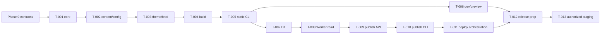

# Mallok MVP 实施计划

- 状态：Approved roadmap
- 日期：2026-08-27
- 当前阶段：Phase 0 文档冻结

本计划与实现工具无关。负责人冻结产品契约，实施者在受限任务内编码，审查者独立复验。Claude Code、Codex 或人工开发者都只是“实施者”，不能成为权威来源。

## 1. 固定闭环

```text
冻结 reference/ADR/AC 与 task
  -> 实施者只读复述范围
  -> 独立 worktree 最小实现 + 测试
  -> 实施者运行 task 命令
  -> 审查者检查 diff 并独立重跑
  -> 编号 finding 定向返工
  -> 更新 traceability/status
  -> 合入下一阶段
```

每个 task 必须满足 [DEVELOPMENT.md](DEVELOPMENT.md) 的合同；AI 使用细节见 [CLAUDE_CODE.md](CLAUDE_CODE.md)，但 `.claude/**` 不承载产品或验收真相。

## 2. 阶段门

### Phase 0：规范冻结

交付：产品、架构、配置/内容、Theme、build、CLI、HTTP、D1、Cloudflare、安全、测试、运行、版本、验收、追踪和 T-001..T-013。

退出门：

- `docs/README.md` 中所有 required reference 存在且无断链；
- 同一字段/状态/路由只存在一个规范性定义；
- machine-readable schema/OpenAPI 可解析；
- FR/NFR 全部映射到 task 和 AC；
- 无待定占位符、未裁决的互斥行为、外部 prompt 阈值或需实施者自行决定的公共接口；
- 当前未实现状态明确，文档不冒充已通过测试。

验证：`AC-0-01..06`。

### Phase 1A：平台无关 core

Task：T-001。

范围：workspace、内容规范化、canonical JSON/hash、Markdown/sanitize、SafeHtml/attribute/URL/JSON helper、route/filter、memory repository contract。

明确不做：文件系统、配置加载、完整 Theme、CLI、Cloudflare。

退出门：`AC-1A-*`；pack/import smoke 也必须通过，不能只测 `src/index.ts`。

### Phase 1B：静态 alpha

依序执行：

| Task | 交付 |
| --- | --- |
| T-002 | config/YAML/frontmatter/file repository/聚合诊断 |
| T-003 | Theme API、基础主题、RSS/sitemap、跨 runtime bundle |
| T-004 | BuildWriter、route/resource manifest、失败安全替换 |
| T-005 | init/new/validate/build/doctor、basic-blog E2E |

退出门：`AC-1B-*`。此时可称 `static alpha`，Theme API 仍 experimental；不能称整个 Mallok MVP 完成。

### Phase 1C：本地开发体验

Task：T-006。

交付：dev、watch、错误覆盖、preview、loopback 安全与最后成功产物保留。

退出门：`AC-1C-*`。

### Phase 2A：Cloudflare 读取 alpha

依序执行：

| Task | 交付 |
| --- | --- |
| T-007 | D1 migration、row codec、published repository/query |
| T-008 | Cloudflare candidate build、Worker public router、ASSETS、动态首页/文章/feed、跨模式 DOM |

退出门：`AC-2A-*`。只证明本地 Cloudflare runtime 读取；尚未提供安全远程写入。

### Phase 2B：安全发布 alpha

依序执行：

| Task | 交付 |
| --- | --- |
| T-009 | publish/unpublish domain、管理 API、auth/CAS/idempotency/fault injection |
| T-010 | publish/unpublish CLI、diff、asset 校验、ETag/cache verification |

退出门：`AC-2B-*`。真实 CDN 60 秒目标不在本地阶段冒充通过。

### Phase 2C：部署编排

Task：T-011。

交付：state、immutable candidate + per-lock Wrangler config、provision plan/apply、D1 fence/external journal、非激活version upload + exact target UUID + 显式activation、provider-call request/result evidence、migration/deploy dry-run、recover/repair/rollback/normal abort-to-baseline与首次部署fail-closed恢复，以及non-TTY/CI fail-closed行为。

退出门：`AC-2C-*`。常规验收只允许 local/dry-run；没有授权不得触发云端动作。

### Phase 3：MVP 发布候选

依序执行：

| Task | 交付 |
| --- | --- |
| T-012 | create-mallok、tarball fresh install、完整文档/CI/perf/a11y/license/security release gate |
| T-013 | Stage A 由编码助手准备 recording contract；Stage B 仅人工云端操作者在绑定 T-012 evidence 的限时 marker 下，对 fresh-only Worker/D1 执行 staging smoke 与 ownership-based cleanup |

若没有 staging 权限，T-013 保持 `BLOCKED_BY_AUTHORIZATION`，不得把 Phase 2 local/dry-run 改名为 staging verified。

Phase 3 的 `AC-3-*` 与 `AC-NFR-*` 全部通过、无 P0/P1 finding 后，才能标记 MVP release candidate。

### Phase 4：Mallok Studio（不属于本计划交付）

进入条件：Phase 3 accepted、管理 API 稳定、作者真相/浏览器认证/RBAC 有新 PRD 与 ADR。GUI 不得把长期 CLI bearer token 放进浏览器，也不得直接写 D1。

视觉实施前必须先提供三个可比较方向，由产品负责人选择一个；当前文档阶段不设计或编码 GUI。

## 3. 依赖关系



T-007 可以在 T-006 前并行，但 T-008 依赖 T-003 的 universal theme contract；同一实现者不得用并行工作破坏锁定公共 API。

## 4. 全局质量门

每阶段至少运行受影响包的 lint/typecheck/test/build；合入阶段边界运行：

```bash
pnpm lint
pnpm typecheck
pnpm test:coverage
pnpm build
pnpm test:integration
```

Phase 1B 增加 static/determinism/cross-runtime；Phase 2 增加 cloudflare-local/security；Phase 3 增加 pack/license/audit/perf/a11y。完整脚本见 [TESTING.md](TESTING.md)。

## 5. 变更控制

- reference 或 accepted ADR 变化：先更新文档、AC/traceability，再创建新 task revision；
- direct dependency/lock/toolchain 变化：独立审查；明确授权的功能 task 可以先提交仅含 package manifest、lockfile 和最小注册元数据的 `dependency-only first diff`，reviewer 批准后才开始功能编码；否则使用独立 dependency task，任何情况下都不得把未审查的依赖变化夹进功能 diff；
- D1 migration 一旦 staging/production 应用，不得编辑，只追加；
- task 允许路径外发现必要改动：返回 BLOCKED，由负责人扩 task，不得顺手修改；
- 安全边界不得以“先做 MVP”为由降低；功能范围可以后移。

## 6. 明确延期

- GUI/Studio、账号/RBAC/远程草稿；
- R2 上传/媒体库/图片转换；
- plugin/theme marketplace、在线第三方主题；
- 多语言、collection、tag archive/pagination；
- 多云 deploy adapter、静态托管一键发布；
- analytics、search、commerce、AI 写作；
- 增量静态再生和自动历史 revision GC。
