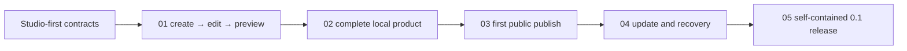

# Mallok Studio-first 0.1 实施计划

- 状态：Approved Studio-first MVP roadmap
- 日期：2026-08-27
- 当前阶段：产品路线重置，尚无实现

Mallok 0.1 的交付物是普通用户可直接使用的 Mallok Studio，不是等待未来再包装的开发者内容引擎。默认成功路径必须做到：**0 次终端操作、0 个手写配置文件、0 个 Node/pnpm/Git/D1/Wrangler 前置知识**。CLI 是共享应用能力的次级 adapter，不是 Studio 的实现依赖，也不是 0.1 的验收替代品。

## 1. 0.1 用户结果

目标用户从下载或打开 Mallok 开始，能够完成：

```text
创建站点
  -> 选择官方模板
  -> 填写站点信息
  -> 编辑或导入内容与图片
  -> 在 Studio 内预览
  -> 导出静态站或连接托管并首次发布
  -> 更新已发布文章
  -> 在失败时重试或恢复上一个已知正常版本
```

本地创建、编辑、预览和静态导出不要求账号。公网发布必然需要一个托管责任方；0.1 只实现一条经产品负责人批准的 Cloudflare 账号连接路径，不把“用户自有 Cloudflare”与“Mallok 自建托管”混成未决实现细节。

## 2. 路线原则

1. **垂直切片**：每个任务都必须产生可见、可操作的用户结果，同时补齐该结果所需的最小 core、application service 和 adapter；禁止先完成数个无用户界面的底层阶段再补 Studio。
2. **Studio-first**：Studio 直接调用 application/use-case service。不得 shell out 到 CLI，不得在 UI 组件中复制业务规则。
3. **Markdown 是可携带格式，不是使用门槛**：Studio 可以用表单或可视编辑方式写入规范 Markdown；高级用户仍可直接编辑文件。
4. **一个默认路径**：首次用户不选择 runtime、target、数据库或部署策略。static/Cloudflare、D1、migration 和 recovery 是内部能力或高级详情。
5. **诚实发布**：静态导出不叫“已上线”；只有取得可访问公网 URL 并通过 smoke 才显示“已发布”。
6. **失败可恢复**：任何远程写入都要有明确计划、幂等边界和恢复入口；UI 隐藏术语，但不能隐藏状态或副作用。
7. **逐步冻结**：分发形态、首发桌面平台、Cloudflare 授权方式、声明式项目格式与模板信任边界必须在对应任务编码前由 ADR/reference 冻结，不能由实现者临场选择。

## 3. 五个垂直任务

| 顺序 | 活动任务 | 用户可见结果 | 主要退出门 |
| --- | --- | --- | --- |
| 1 | [01-walking-skeleton](tasks/01-walking-skeleton.md) | 创建站点、选模板、编辑文章、内嵌预览 | `AC-01-*` |
| 2 | [02-local-product](tasks/02-local-product.md) | 3 个模板、图片优化、SEO/sitemap、PageSpeed 门、静态导出、本地恢复 | `AC-02-*` |
| 3 | [03-cloudflare-publish](tasks/03-cloudflare-publish.md) | 连接托管并取得首个公网 URL | `AC-03-*` |
| 4 | [04-update-recovery](tasks/04-update-recovery.md) | 更新文章、原子发布、重试、恢复上一版本 | `AC-04-*` |
| 5 | [05-release](tasks/05-release.md) | 自包含安装包、全新环境与真人用户验证 | `AC-05-*` |

依赖保持线性，避免同时维护多套半成品产品状态：



旧 `docs/tasks/T-*.md` 属于 CLI-first 历史路线，不再是活动实现入口。它们已经从当前活动目录移除；若在 Git 历史或归档中查到，也不得执行或与上述任务混用 AC。

## 4. 阶段定义

### 4.1 Walking skeleton

只实现最薄但真实的 Studio 主路径：启动、建站、选择一个内置模板、填写基础信息、编辑一篇文章、保存为可携带内容、内嵌预览。底层模块只为这条路径服务，不提前实现云发布、完整模板市场或复杂 CLI。

### 4.2 完整本地产品

把 walking skeleton 补成无需云端也有价值的本地产品：三个官方模板、受管图片自动优化、compiler-owned SEO/sitemap、静态导出、自动保存、异常退出恢复和项目重开。此阶段完成后，可以诚实地说“Mallok 能在本地完成并导出一个通过技术 SEO 与固定 PageSpeed 门的内容站”，但不能说已经一键上线、已被搜索引擎收录或已经完成公网发布。

### 4.3 首个 Cloudflare 公网发布

只支持一个批准的 Cloudflare 发布路径。Studio 负责账号连接、最小权限、目标与费用提示、计划、确认、部署进度、默认公网 URL 和 smoke。普通用户不复制 token、不运行 Wrangler、不打开 Cloudflare 控制台配置 D1/Worker。

### 4.4 更新与恢复

在已发布站点上加入不可变 PublishBundle staging、文章更新/下线、资源闭合检查、以 `bundleHash` 为重试身份的安全重放、D1 current bundle 原子切换、结果未知恢复和上一个已知正常版本恢复。用户看到的是“发布更改、重试、恢复上一版本”；底层不引入文档 revision 系统或单独的 idempotency ledger。

### 4.5 0.1 发行

为一个已冻结的首发平台制作自包含发行物，完成签名/来源验证、全新机器安装、升级与卸载边界、许可证和 secret 检查、Studio/站点可访问性、性能与真人任务测试。只有这一阶段通过后才能称 0.1 release candidate。

## 5. 每个任务的执行合同

实现者每次只能执行一个活动任务，并且必须：

- 在修改前记录 clean base SHA、工作区状态和已批准的产品决策；
- 复述用户可见结果、范围、非目标、依赖与停止条件；
- 只实现本任务闭环所需的最小纵向能力；
- 先建立测试证据，再把结果接到 Studio；
- 按 [TESTING.md](TESTING.md) 中列出的**验证类别 ID**提供真实 test path 与实际命令；文档中的类别不是已存在脚本；
- 运行本任务届时已经注册的全部验证入口，并记录退出码、环境和 verified SHA；
- 不因 UI 简单而降低内容清洗、路径、secret、D1 原子性或远程恢复边界；
- 交付结构化报告，等待独立复验后再进入下一任务。

任务需要新增或升级依赖时，必须先提交 dependency-only diff，记录精确版本、许可证、engines、安装脚本、包体和 runtime 归属。没有批准不得安装或继续功能编码。

## 6. 0.1 Definition of Done

同时满足以下条件才是 Mallok 0.1：

- 从自包含发行物启动，默认路径不需要终端、Node、pnpm、Git 或手写配置；
- 三个官方模板均可创建、编辑、预览、导出并发布；
- 受管图片优化、SEO/sitemap/robots、静态导出和本地恢复可用；
- 经授权的 Cloudflare 首发、文章更新、失败重试和上一版本恢复通过真实 staging；
- Studio 与 CLI/测试 adapter 共用 application service，没有第二套业务真相；
- 所有适用 `AC-01-*` 至 `AC-05-*` 与跨阶段 AC 在同一候选 SHA 有证据；
- 无 P0/P1 finding，发布事实与 [STATUS.md](STATUS.md) 一致；
- 不少于 10 名目标用户的任务测试达到 [TESTING.md](TESTING.md) 的门槛。

## 7. 0.1 明确延期

- 多人协作、RBAC、多设备草稿同步；
- Mallok 自建 SaaS 控制面、账号、计费和 `*.mallok.dev` 托管；
- R2 媒体库、多宽度 `srcset`、手工裁剪、动画/视频优化和完整资产管理；
- 第三方模板/插件市场及不受信任代码沙箱；
- 多云部署、自定义 provider adapter；
- 多语言、collection、公开站点全文搜索、电商、analytics、AI 写作；
- 第二个桌面平台，除非产品负责人在 Task 05 前明确把它加入 0.1 门。
